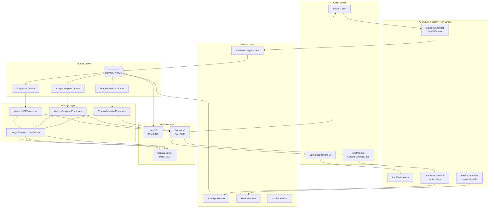

# @CKIR.IO/VISIONS: An AI-Powered Vision Analysis Microservice

## Abstract

This wiki documents the design, implementation, and operational characteristics of **@CKIR.IO/VISIONS**, a NestJS-based microservice monorepo for image analysis using locally-hosted Ollama vision models. The system exposes two primary ingress protocols—a RESTful multipart API and a Model Context Protocol (MCP) JSON-RPC 2.0 endpoint—unified under a single Fastify HTTP server augmented with a Socket.IO real-time transport layer. Asynchronous job execution is delegated to BullMQ workers backed by Redis/KeyDB; image preprocessing is performed within the worker by the Sharp pipeline before Ollama inference. The project demonstrates that generative coding workflows, while accelerating exploration, require a disciplined remediation cycle—*owning the code*—before production deployment.

## System Overview

## Communication Patterns

| Pattern | Protocol | Use Case |
|---------|----------|----------|
| **Synchronous (HTTP)** | REST / JSON-RPC | Request submission, health checks, model listing, job cancellation |
| **Asynchronous (Queue)** | BullMQ / Redis | Image processing, AI inference, result preparation |
| **Real-time (WebSocket)** | Socket.IO | Streaming status, progressive token delivery, final result dispatch |

## Documentation Index

### Getting Started
- [0.1. Quick Start](0.1-quick-start.md)

### Server Architecture
- [1. Server Overview](1-server.md)
- [1.1. REST Interfaces](1.1-rest.md)
- [1.2. MCP Interfaces](1.2-mcp.md)
- [1.3. BullMQ Async Processing](1.3-bullmq.md)
- [1.4. Socket.IO Real-time Layer](1.4-socketio.md)
- [1.5. Image Preprocessing Pipeline](1.5-image-preprocessing.md)

### Dashboard
- [2. Dashboard Overview](2-dashboard.md)
- [2.1. Frontend Architecture](2.1-architecture.md)
- [2.2. Color Harmony & Theming](2.2-color-harmony.md)
- [2.3. State Management & Real-time Events](2.3-state-and-realtime.md)

### Methodology
- [3. AI-Assisted Development: Vibe Coding, Context Coding, and Code Ownership](3-ai-assisted-development.md)
- [3.1. Market Positioning & Competitive Landscape](3.1-market-positioning.md)

## Quick Start

For a step-by-step Docker Compose setup, see [0.1 Quick Start](0.1-quick-start.md).

## Technology Matrix

| Domain | Technology | Role |
|--------|-----------|------|
| Backend Runtime | Node.js 18+ | Server-side TypeScript execution (ES module mode) |
| Framework | NestJS (Fastify adapter) | Dependency-injected modular architecture |
| HTTP Server | Fastify | High-throughput, low-latency request handling |
| Job Queue | BullMQ | Async task scheduling and worker orchestration |
| Real-time | Socket.IO (Redis adapter) | Cross-server event broadcasting |
| AI Backend | Ollama | Local LLM inference with vision model support |
| Image Processing | Sharp (libvips) | Grayscale, resize, sharpen, Gaussian blur, CLAHE |
| Frontend | Vue 3 Composition API | Declarative UI with reactive state |
| Bundler | Vite 5 | Fast HMR and optimized production builds |
| Styling | Tailwind CSS v4 | Utility-first CSS with CSS custom properties |
| State | Pinia | Type-safe reactive store management |
| Queries | TanStack Vue Query | Server-state synchronization and caching |

---

*This project demonstrates the tension between generative coding velocity and software engineering discipline, explored in detail in [Section 3](3-ai-assisted-development.md).*
