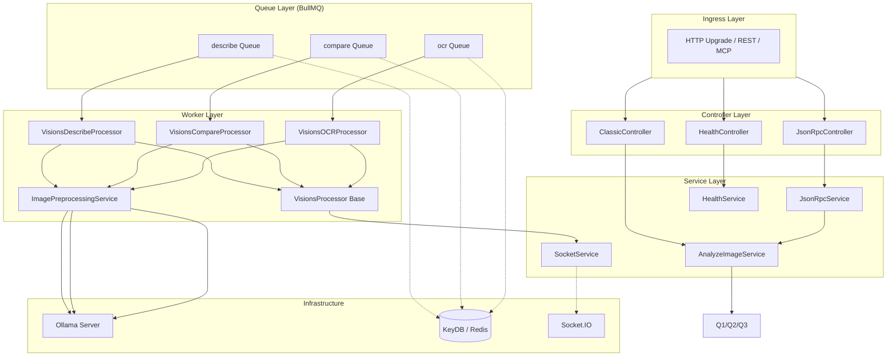
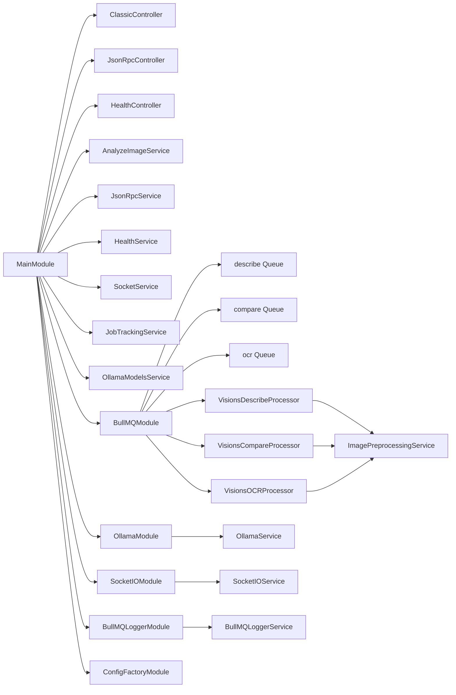

# 1. Server Overview

## Architectural Rationale

The @CKIR.IO/VISIONS server implements a **layered hexagonal architecture** within the NestJS framework. All ingress traffic—REST, MCP, and Socket.IO—terminates at a single Fastify adapter to avoid port proliferation and CORS fragmentation. Business logic is factored into discrete services, while side-effect-heavy operations (AI inference, real-time broadcasting) are offloaded to BullMQ workers to prevent the event loop from blocking on synchronous GPU-bound operations.



## Endpoint Registry

| Path | Controller | Method | Description |
|------|-----------|--------|-------------|
| `POST /api/v1/vision` | `ClassicController` | `POST` | REST image analysis (multipart `task`, `images`, optional `prompt`/`preprocessing`) |
| `POST /api/v1/vision/cancel` | `ClassicController` | `POST` | Cancel a queued or active job by `requestId` |
| `GET /api/v1/vision/models` | `ClassicController` | `GET` | List available Ollama models via `OllamaModelsService` (returns `{ models: [...] }`) |
| `POST /api/v1/mcp` | `JsonRpcController` | `POST` | MCP JSON-RPC 2.0 endpoint (`initialize`, `tools/list`, `visions.analyze`) |
| `GET /api/v1/health/ready` | `HealthController` | `GET` | Readiness probe; verifies Ollama and KeyDB connectivity |
| `GET /api/v1/health/live` | `HealthController` | `GET` | Liveness probe; basic process health |

## Shared Infrastructure

### Fastify Multipart & Compression

```typescript
// main.ts (excerpt)
const adapter = new FastifyAdapter({ bodyLimit: getBodyLimit(env.BODY_LIMIT) });
await APP.register(fastifyMultipart, { attachFieldsToBody: true });
await APP.register(compress, {
  threshold: 1024,
  encodings: ["br", "gzip"],
  global: false,
  customTypes: /json/i,
});
```

Multipart parsing is handled by `@fastify/multipart` with `attachFieldsToBody: true`, enabling field-based access to `task`, `prompt`, and `preprocessing` without manual stream consumption. Brotli/gzip compression is applied only to JSON responses to prevent corruption of Swagger UI static assets.

### URI Versioning

```typescript
APP.enableVersioning({
  type: VersioningType.URI,
  defaultVersion: "1",
  prefix: "api/v",
});
```

All routes are prefixed with `/api/v1/`. Ingress at the root path or `api/v2` returns a 404, enforcing version boundaries explicitly.

### Socket.IO Attachment

```typescript
await SocketIOModule.attach(APP);
```

The Socket.IO server binds to the same Fastify listener, sharing the underlying HTTP port. A Redis adapter is optionally configured (`@ehildt/nestjs-socket.io`) for horizontal scaling. The `SocketService` wraps `emitTo` operations with null-safe guards, preventing crashes when the adapter is uninitialized.

## Module Dependency Graph



## Request Lifecycle

```mermaid
sequenceDiagram
    participant Client
    participant Controller
    participant Service as AnalyzeImageService
    participant Queue as BullMQ Queue
    participant Worker as Vision Worker
    participant Preproc as ImagePreprocessingService
    participant Ollama
    participant Socket as Socket.IO

    Client->>Controller: POST /api/v1/vision<br/>multipart/form-data
    Controller->>Service: toFilePayloads(images) + emit()
    Service->>Queue: addJob({ buffers, meta, filters })
    Queue-->>Controller: Job ID / Acceptance
    Controller-->>Client: 202 Accepted + realtime info

    Queue->>Worker: process job
    alt preprocessing enabled
        Worker->>Preproc: preprocessImages(buffers, meta, filters.preprocessing)
        Preproc-->>Worker: PreprocessedImage[]
    end
    Worker->>Ollama: chat(messages, stream)
    Ollama-->>Worker: progressive tokens
    Worker->>Socket: emitToSocket(roomId, event, data)
    Socket-->>Client: real-time fragments
    Worker->>Queue: job.completed
```



## Error Handling Strategy

| Layer | Mechanism | Notes |
|-------|-----------|-------|
| **Controller** | NestJS `BadRequestException` / `UnprocessableEntityException` | Pipes (`JsonRpcValidationPipe`, `ParsePromptPipe`) intercept malformed input before service entry |
| **Service** | BullMQ `UnrecoverableError` | Cancelled jobs or irrecoverable model failures are marked non-retryable |
| **Worker** | `@OnWorkerEvent('failed')` | Emits cancellation or error payloads via Socket.IO; cleanup via `JobTrackingService` |
| **Preprocessing** | Silent fallback | If Sharp fails, the original buffer is forwarded unmodified so analysis can proceed |

## Configuration Stack

Environment variables are ingested through a typed adapter pattern (`@ehildt/nestjs-config-factory`):

| Service | Key Config | Description |
|---------|-----------|-------------|
| `AppConfigService` | `PORT`, `ADDRESS`, `CORS_ORIGIN` | HTTP listener binding and CORS allowlist |
| `BullmqConfigService` | `BULLMQ_HOST`, `BULLMQ_PORT`, `BULLMQ_JOB_ATTEMPTS` | Redis connection topology and retry policy |
| `OllamaConfigService` | `OLLAMA_HOST`, `SYSTEM_PROMPTS`, `KEEP_ALIVE` | Model endpoint and prompt constants |
| `SocketIOConfigService` | `SOCKET_IO_EVENT`, `TRANSPORTS`, `PING_INTERVAL` | Real-time event naming and transport configuration |
