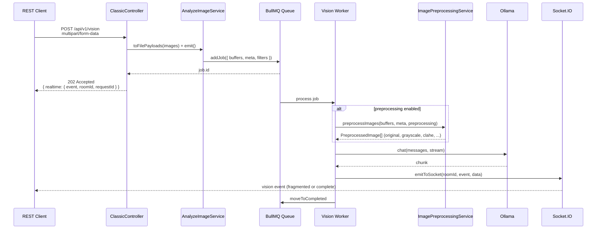

# 1.1 REST Interfaces

## Protocol Design

The REST API provides a single multipart/form-data ingress point for image analysis. Adherence to HTTP semantics is strict: `POST /api/v1/vision` returns `202 Accepted` to signal asynchronous enqueueing rather than synchronous completion. All results are delivered retroactively via Socket.IO, decoupling the HTTP lifecycle from long-running GPU inference.

## Endpoint Specification

### `POST /api/v1/vision`

**Required Headers**

| Header | Value | Semantics |
|--------|-------|-----------|
| `x-vision-llm` | Model tag (e.g., `llama3.2-vision`) | Target Ollama model; validated by header extraction in `ClassicController` |

**Query Parameters**

| Parameter | Type | Required | Description |
|-----------|------|----------|-------------|
| `requestId` | `string` | Yes | Client-generated correlation identifier; used for job tracking, room naming, and cancellation |
| `stream` | `boolean` | No | Enable streaming via `ollama.chat` with streaming callback; default `false` |
| `roomId` | `string` | No | Socket.IO room; derived from `requestId` if omitted |
| `event` | `string` | No | Event name emitted by Socket.IO; default read from `SOCKET_IO_EVENT` config |
| `numCtx` | `number` | No | Model context window size (overrides default) |

**Multipart Body Fields**

| Field | Type | Required | Description |
|-------|------|----------|-------------|
| `images` | `File[]` | Yes | One or more images (PNG, JPG, JPEG, WEBP) |
| `task` | `string` | Yes | `describe`, `compare`, or `ocr` |
| `prompt` | `json` | No | Array of message objects `[{"role":"user","content":"..."}]` |
| `preprocessing` | `json` | No | Preprocessing options; see [1.5 Image Preprocessing Pipeline](1.5-image-preprocessing.md) |

### `POST /api/v1/vision/cancel`

| Parameter | Type | Required |
|-----------|------|----------|
| `requestId` | `string` | Yes |

Sets an atomic flag in `JobTrackingService`. Active jobs detect cancellation via `isCanceled(requestId)` during the streaming loop and raise `UnrecoverableError`, preventing retries.

### `GET /api/v1/vision/models`

Returns an array of strings representing locally available Ollama models, hydrating the dashboard model selector.

## Request Flow



## Controller Code Structure

```typescript
// classic.controller.ts (conceptual)
async visionStream(
  @Query(REQUEST_ID) requestId: string,
  @Headers(X_VISION_LLM) vLLM: string,
  @MultiPartValue(TASK) task: MultipartValue<VisionTask>,
  @MultiPartFiles() images?: MultipartFile[],
): Promise<ClassicControllerResponse> {
  const buffers = await this.analyzeImageService.toFilePayloads(requestId, images);
  const meta = extractMeta(images);
  const filters = buildFilters({ requestId, vLLM, task, stream, numCtx, preprocessing });

  void this.analyzeImageService.emit({ buffers, meta, filters });

  return { realtime: { event, roomId: filters.roomId, requestId } };
}
```

The `void` prefix on `emit()` ensures the enqueueing operation is fire-and-forget from the HTTP response lifecycle, preventing the controller from awaiting potentially slow queue insertion. Preprocessing configuration is passed through `filters.preprocessing` and applied later, inside the BullMQ worker, not during the HTTP request.

## Response Contracts

### HTTP 202 Response

```json
{
  "realtime": {
    "event": "vision",
    "roomId": "room-123",
    "requestId": "1234"
  }
}
```

### Socket.IO Event Payload (`vision`)

```json
{
  "meta": [
    {
      "name": "photo.jpg",
      "type": "image/jpeg",
      "hash": "abc123...",
      "requestId": "1234",
      "variant": "original"
    }
  ],
  "task": "describe",
  "message": {
    "role": "assistant",
    "content": "The image shows a cat sitting on a windowsill..."
  },
  "done": false
}
```

| Field | Type | Semantics |
|-------|------|-----------|
| `meta` | `ImageMeta[]` | One entry per preprocessed variant (not per original file) |
| `task` | `string` | Echo of the requested task type |
| `message` | `Message` | LLM assistant role and token content |
| `done` | `boolean?` | Streaming sentinel; omitted in non-streaming mode |

## REST vs MCP Comparison

| Aspect | REST | MCP |
|--------|------|-----|
| Endpoint | `/api/v1/vision` | `/api/v1/mcp` |
| Content-Type | `multipart/form-data` | `application/json` |
| Task specification | `task` form field directly | `arguments.task` inside JSON-RPC payload |
| Prompt delivery | `prompt` form field | `arguments.prompt` inside JSON-RPC |
| Images | `images` multipart files | `arguments.images[]` base64 objects |
| Preprocessing toggle | `preprocessing` form field | `arguments.preprocessing` nested object |
| Parameter prefix | `pproc_*` query params | `arguments.preprocessing.*` nested object |
| Model selection | `x-vision-llm` header | `arguments.model` field |
| Response envelope | `{ realtime: {...} }` | JSON-RPC 2.0 `{ result: { content, isError, realtime } }` |
| Error format | HTTP status + JSON body | JSON-RPC error object with `code` and `message` |

## Preprocessing Query Parameter Mapping

On REST, preprocessing keys are flattened as individual query parameters prefixed with `pproc_`. This design decision accommodates HTTP client limitations that struggle with nested JSON in query strings while preserving type safety via `ImagePreprocessingOptionsDto`.

| REST Query Param | JSON-RPC Path | Type | Default |
|------------------|---------------|------|---------|
| `pproc_enabled` | `arguments.preprocessing.enabled` | `boolean` | `false` |
| `pproc_resize_maxWidth` | `arguments.preprocessing.resize.maxWidth` | `number` | `768` |
| `pproc_resize_maxHeight` | `arguments.preprocessing.resize.maxHeight` | `number \| null` | `null` |
| `pproc_resize_withoutEnlargement` | `arguments.preprocessing.resize.withoutEnlargement` | `boolean` | `true` |
| `pproc_original` | `arguments.preprocessing.variants.original` | `boolean` | `true` |
| `pproc_grayscale` | `arguments.preprocessing.variants.grayscale` | `boolean` | `true` |
| `pproc_denoised` | `arguments.preprocessing.variants.denoised` | `boolean` | `true` |
| `pproc_sharpened` | `arguments.preprocessing.variants.sharpened` | `boolean` | `false` |
| `pproc_clahe` | `arguments.preprocessing.variants.clahe` | `boolean` | `true` |
| `pproc_blurSigma` | `arguments.preprocessing.parameters.blurSigma` | `number` | `0.5` |
| `pproc_sharpenSigma` | `arguments.preprocessing.parameters.sharpenSigma` | `number` | `1` |
| `pproc_sharpenM1` | `arguments.preprocessing.parameters.sharpenM1` | `number` | `1` |
| `pproc_sharpenM2` | `arguments.preprocessing.parameters.sharpenM2` | `number` | `2` |
| `pproc_brightnessLevel` | `arguments.preprocessing.parameters.brightnessLevel` | `number` | `1.2` |
| `pproc_claheWidth` | `arguments.preprocessing.parameters.claheWidth` | `number` | `8` |
| `pproc_claheHeight` | `arguments.preprocessing.parameters.claheHeight` | `number` | `8` |
| `pproc_claheMaxSlope` | `arguments.preprocessing.parameters.claheMaxSlope` | `number` | `3` |
| `pproc_normalizeLower` | `arguments.preprocessing.parameters.normalizeLower` | `number` | `1` |
| `pproc_normalizeUpper` | `arguments.preprocessing.parameters.normalizeUpper` | `number` | `99` |

## Swagger / OpenAPI

Auto-generated Swagger documentation is served at `http://{host}:{port}/docs`. Decorators on `ClassicController` enumerate each field, content type, and response code, enabling type-safe client generation. The `fastify-compress` middleware explicitly skips compressing `text/html` (Swagger UI) to mitigate rendering issues.
