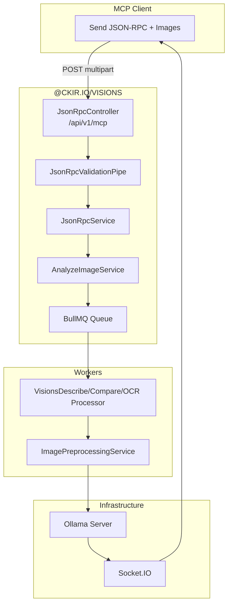

# 1.2 MCP Interfaces

## Protocol Design

The Model Context Protocol (MCP) endpoint implements a JSON-RPC 2.0 transport over `application/json`. Binary image data is transmitted inline via base64-encoded strings inside the JSON-RPC `params.arguments.images` array. This design obviates the need for multipart form handling on the MCP path while preserving the same asynchronous lifecycle: immediate acknowledgment (200 for sync methods, 202 for `tools/call`) followed by result delivery via Socket.IO.



## MCP Method Reference

### `initialize`

**Request:**

```json
{
  "jsonrpc": "2.0",
  "method": "initialize",
  "params": {
    "protocolVersion": "2025-11-25",
    "capabilities": {},
    "clientInfo": { "name": "my-client", "version": "1.0.0" }
  },
  "id": 0
}
```

**Response:**

```json
{
  "jsonrpc": "2.0",
  "id": 0,
  "result": {
    "protocolVersion": "2025-11-25",
    "capabilities": { "tools": { "listChanged": false } },
    "serverInfo": { "name": "@ckir.io/visions", "version": "1.1.0" }
  }
}
```

The `serverInfo.name` and `version` are dynamically resolved from `package.json` at runtime, eliminating version drift between source and protocol handshake.

### `tools/list`

Returns the singular exposed tool `visions.analyze` along with its JSON Schema input definition.

**Response Snippet:**

```json
{
  "tools": [{
    "title": "Vision Analysis",
    "name": "visions.analyze",
    "description": "Perform a specific visual analysis on provided images...",
    "inputSchema": {
      "type": "object",
      "additionalProperties": false,
      "required": ["images", "prompt", "task"],
      "properties": {
        "task": { "type": "string", "enum": ["describe", "compare", "ocr"] },
        "prompt": { "type": "string" },
        "preprocessing": { "type": "object" }
      }
    }
  }]
}
```

### `tools/call`

**Query Parameters:** None. Everything is carried in the JSON body.

**JSON Body:**

```json
{
  "jsonrpc": "2.0",
  "id": 1,
  "method": "tools/call",
  "params": {
    "name": "visions.analyze",
    "arguments": {
      "requestId": "abc-123",
      "model": "llama3.2-vision",
      "task": "describe",
      "stream": true,
      "roomId": "room-abc",
      "event": "vision",
      "numCtx": 16384,
      "prompt": [{"role":"user","content":"What do you see?"}],
      "images": [
        { "data": "iVBORw0KGgo...", "mimeType": "image/png", "name": "photo.png" }
      ],
      "preprocessing": {
        "enabled": true,
        "variants": { "grayscale": true, "clahe": true }
      }
    }
  }
}
```

`images` is an **array of objects** with:
- `data` — base64-encoded image bytes (required)
- `mimeType` — e.g. `image/png` (optional; defaults to `image/png`)
- `name` — optional filename

**Request Example:**

```json
{
  "jsonrpc": "2.0",
  "method": "tools/call",
  "params": {
    "name": "visions.analyze",
    "arguments": {
      "requestId": "abc-123",
      "model": "llama3.2-vision",
      "task": "describe",
      "stream": true,
      "roomId": "room-abc",
      "event": "vision",
      "numCtx": 16384,
      "prompt": [{"role": "user", "content": "What do you see?"}],
      "images": [
        { "data": "iVBORw0KGgo...", "mimeType": "image/png", "name": "photo.png" }
      ],
      "preprocessing": {
        "enabled": true,
        "variants": { "grayscale": true, "clahe": true }
      }
    }
  },
  "id": 2
}
```

## Controller Dispatch Logic

```typescript
// json-rpc.controller.ts
async rpc(@McpPayload() req: McpGenericType<McpVisionPayloadReq_Params>) {
  if (req.method === 'initialize')
    return this.wrap(req.id, await this.jsonRpcService.initialize());

  if (req.method === 'tools/list')
    return await this.jsonRpcService.getRequestedTools(req);

  if (req.method === 'notifications/initialized') return;

  const args = req.params?.arguments;
  if (!args?.model)
    throw new BadRequestException("Missing 'model' in arguments");
  if (!args.images || args.images.length === 0)
    throw new BadRequestException("Missing images");

  const results = await this.jsonRpcService.toFilePayloadsFromBase64(
    args.requestId, args.images
  );

  const name = req.params?.name;
  if (name === 'visions.analyze')
    return this.wrap(req.id, await this.jsonRpcService.analyze({
      buffers: results.map(r => r.buffer).filter(Boolean),
      meta: results.map(r => r.meta).filter(Boolean) as any,
      filters: {
        vLLM: args.model,
        requestId: args.requestId,
        roomId: args.roomId,
        stream: args.stream ?? false,
        numCtx: args.numCtx,
        prompt: args.prompt,
        task: args.task,
        event: args.event ?? this.socketIOConfigService.config.event,
        preprocessing: args.preprocessing,
      },
    }));
}
```

The `JsonRpcValidationPipe` applies schema enforcement over the deserialized JSON-RPC payload using `@nestjs/common` `ValidationPipe` semantics, ensuring `params.arguments.task` conforms to the `VisionTask` enum before service invocation.

## Response Lifecycle

### Immediate MCP Response (202)

```json
{
  "jsonrpc": "2.0",
  "id": 2,
  "result": {
    "content": [
      {
        "type": "text",
        "text": "Processing started. Connect to Socket.IO for real-time results."
      }
    ],
    "isError": false,
    "realtime": {
      "event": "vision",
      "roomId": "optional-room-id",
      "requestId": "batch-001"
    }
  }
}
```

### Streaming Socket.IO Payload

Identical to REST streaming format. The MCP client is expected to subscribe to the Socket.IO room specified in `realtime.roomId` (or derive it from `realtime.requestId`).

```json
{
  "meta": [...],
  "task": "describe",
  "message": { "role": "assistant", "content": "..." },
  "done": false
}
```

## JSON-RPC Error Contract

| Code | Meaning | Trigger |
|------|---------|---------|
| `-32700` | Parse error | Malformed JSON in multipart payload field |
| `-32600` | Invalid Request | Missing `jsonrpc`, `method`, or `id` |
| `-32601` | Method not found | `tools/call` on non-existent tool name |
| `-32602` | Invalid params | Schema validation failure (`@MultiPartPayload`) |
| `400` | Bad Request | HTTP-level multipart parsing failure |

## MCP Status Interceptor

An `McpStatusInterceptor` wraps all MCP controller methods to guarantee JSON-RPC envelope compliance even on unexpected exceptions. It transforms NestJS exceptions into standardized JSON-RPC error payloads:

```typescript
{
  "jsonrpc": "2.0",
  "id": requestId,
  "error": {
    "code": -32603,
    "message": "Internal error: ..."
  }
}
```

This interceptor prevents raw stack traces from leaking to MCP clients, which typically have limited error display capabilities.

## Transport Characteristics

| Characteristic | Value | Rationale |
|----------------|-------|-----------|
| Transport | `application/json` over HTTP/1.1 | Images are base64-encoded inside JSON; no multipart handling needed |
| Versioning | URI versioning (`/api/v1/mcp`) | Consistent with REST; future-proof for protocol evolution |
| Authentication | None | Assumes trusted local network; `model` inside `arguments` serves as model selector |
| Streaming | Socket.IO (WebSocket fallback) | JSON-RPC batch responses are not used; real-time streaming via separate channel |

## Comparison with REST Transport

| Dimension | REST `POST /api/v1/vision` | MCP `POST /api/v1/mcp` |
|-----------|---------------------------|------------------------|
| **Data format** | Flat form fields + multipart | JSON-RPC 2.0 envelope + base64 images |
| **Metadata** | Direct query/body | Nested inside `params.arguments` |
| **Client type** | Custom scripts, curl, HTTP libraries | Claude Desktop, Copilot, agentic AI frameworks |
| **Tool discovery** | Manual / Swagger docs | Automatic via `tools/list` |
| **Preprocessing** | `pproc_*` query params | `arguments.preprocessing.*` nested object |
| **Error shape** | HTTP status + body | JSON-RPC error object |
| **Real-time** | Socket.IO (same as MCP) | Socket.IO (same as REST) |

## Architectural Consistency

Despite differing ingress formats, both REST and MCP flows converge on the same internal pipeline after controller dispatch:

1. **BullMQ enqueueing** via `AnalyzeImageService.emit()`
2. **Worker processing** via `VisionsDescribeProcessor` / `Compare` / `OCR` (including optional **Image preprocessing** via `ImagePreprocessingService`)
3. **Ollama inference** with streaming callback
4. **Socket.IO emission** via `SocketIOService.emitTo()`

This convergence ensures that routing-layer changes do not bifurcate the testing or operational surface of the queue and worker layers.
