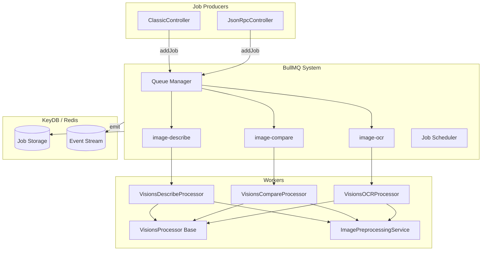
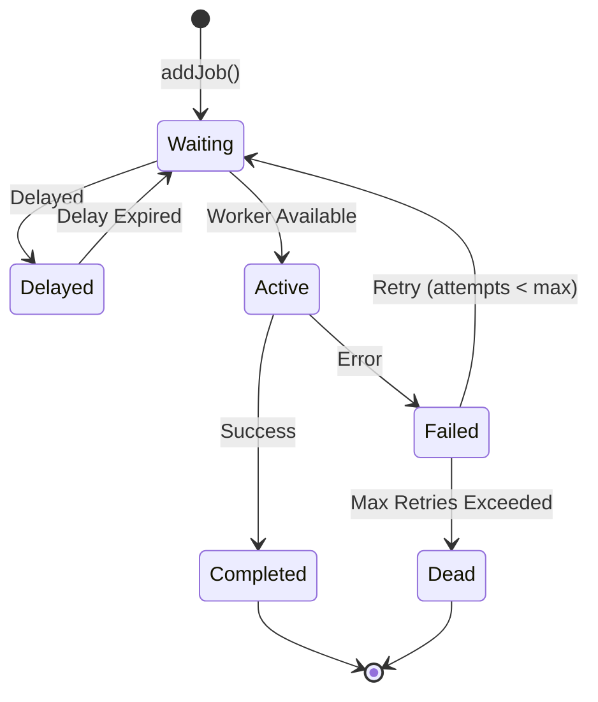

# 1.3 BullMQ Async Processing

## Architectural Rationale

Synchronous waiting on Ollama inference would block the Node.js event loop for seconds to minutes, depending on image size, model load state, and GPU availability. The system therefore adopts an **asynchronous command-bus pattern**: HTTP requests are accepted, validated, immediately acknowledged (`202 Accepted`), and delegated to BullMQ backed by Redis/KeyDB. Workers run in separate processes (conceptually) and emit results via Socket.IO as they become available.



## Queue Topology

| Queue Name | Task Enum | Processor | Concern |
|------------|-----------|-----------|---------|
| `describe` | `describe` | `VisionsDescribeProcessor` | Single-image or multi-image descriptive analysis |
| `compare` | `compare` | `VisionsCompareProcessor` | Cross-image similarity and delta detection |
| `ocr` | `ocr` | `VisionsOCRProcessor` | Text extraction with optional preprocessing enhancement |

Each queue is configured with identical retry, backoff, and retention policies through `BullmqConfigService`.

## Job Data Structure

```typescript
interface VisionJob {
  name: string;
  data: {
    buffers: Buffer[];        // Image data (pre-preprocessing; raw buffers from controller)
    meta: ImageMeta[];        // File metadata per image (variant field populated by worker)
    filters: {
      requestId: string;      // Correlation ID
      roomId?: string;        // Socket.IO room subscription
      stream?: boolean;       // Streaming mode flag
      vLLM: string;           // Target Ollama model tag
      task: VisionTask;       // 'describe' | 'compare' | 'ocr'
      prompt?: Prompt[];      // Optional user-provided prompt
      numCtx?: number;        // Context window override
      preprocessing?: ImagePreprocessingOptions;  // Forwarded to worker-side preprocessor
    };
  };
}

interface ImageMeta {
  name: string;
  type: string;
  hash: string;
  requestId: string;
  variant?: string;           // Set by ImagePreprocessingService inside worker
}
```

## Retry Strategy

BullMQ exponential backoff is configured with an initial delay of **5,270 ms** and a maximum of **15 attempts**.

| Attempt | Cumulative Delay | Rationale |
|---------|-----------------|-----------|
| 1 | 0 ms | Immediate first try |
| 2 | ~5.3 s | Brief backoff for transient network errors |
| 3 | ~15.8 s | GPU warm-up time for freshly loaded models |
| 4 | ~36.9 s | Ollama cold-start latency accommodation |
| 15 | ~5.8 hours | Upper bound for deeply degraded infrastructure |

### Non-Retryable Failures

Certain failure classes bypass the retry mechanism via `UnrecoverableError`, preventing wasted cycles on deterministic failures:

| Failure | Source | Action |
|---------|--------|--------|
| `model not found` | OllamaService | Immediate fatal; client must select a different model |
| `invalid image format` | Sharp preprocessor | Immediate fatal; corrupted or unsupported MIME type |
| `job canceled` | JobTrackingService | Unrecoverable; worker terminates mid-stream |
| `socket emit failure` | SocketIOService | Logged but does not abort inference |

## Worker Architecture

### Base Processor: `VisionsProcessor`

All task processors extend an abstract `VisionsProcessor` that encapsulates common concerns:

```typescript
abstract class VisionsProcessor extends WorkerHost {
  protected async handleVision(
    buffers: Buffer[],
    filters: VisionFilters,
    onChunk?: (chunk: string) => void
  ): Promise<ChatResponse>;

  protected async emitToSocket(
    roomId: string,
    event: string,
    data: VisionResponse
  ): Promise<void>;
}
```

The base class manages:
- **Ollama `chat()` invocation** with streaming callback
- **Socket.IO emission** with null-safe adapter guards
- **Job cancellation polling** via `JobTrackingService.isCanceled()`
- **Worker event logging** via `@ehildt/nestjs-bullmq-logger`

### Task-Specific Implementations

```typescript
class VisionsDescribeProcessor extends VisionsProcessor {
  async process(job: Job): Promise<void> {
    const { buffers, meta, filters } = job.data;
    const systemPrompt = this.config.systemPrompts.DESCRIBE;

    await this.handleVision(buffers, filters, (chunk) => {
      this.emitToSocket(filters.roomId, filters.event, {
        meta, task: 'describe',
        message: { role: 'assistant', content: chunk },
        done: false
      });
    });
  }
}
```

Each subclass injects its own system prompt (defined in `OllamaConfigService.systemPrompts`) and task identifier but reuses the streaming loop and cancellation logic from the base class.

## `keep_alive` Mapping

The `OllamaConfigService` returns the `keepAlive` property in camelCase per TypeScript convention. The `VisionsProcessor` maps this to `keep_alive` (snake_case) when building the Ollama `chat()` request payload:

```typescript
return {
  messages,
  options: { num_ctx: filters.numCtx },
  stream: filters.stream,
  model: filters.vLLM,
  keep_alive: this.ollamaConfigService.config.keepAlive,
};
```

This indirection isolates the internal configuration schema from external SDK expectations, allowing future Ollama API version upgrades without cascading breaking changes.

## Job Lifecycle



| State | Transitions | Observable Events |
|-------|------------|-------------------|
| `waiting` | `addJob()` | `queue.on('waiting')` |
| `active` | Worker pickup | `queue.on('active')` |
| `completed` | Success | `queue.on('completed')` |
| `failed` | Error, retryable | `queue.on('failed')` |
| `delayed` | Backoff expiry | `queue.on('delayed')` |

## Job Events

The `BullMQLoggerService` subscribes to worker events to emit structured logs:

```typescript
@OnWorkerEvent('active')
protected async onActive(job) { this.bullMQLogger.log(job); this.jobTracking.setActive(job.name); }

@OnWorkerEvent('completed')
protected async onCompleted(job) { this.bullMQLogger.log(job); this.jobTracking.remove(job.name); }

@OnWorkerEvent('failed')
protected async onFailed(job) {
  if (failedReason.includes('canceled')) this.bullMQLogger.log(job, 'canceled');
  else this.bullMQLogger.error(job);
  this.jobTracking.remove(job.name);
}
```

## Configuration Reference

```yaml
BULLMQ_HOST: keydb
BULLMQ_PORT: 6379
BULLMQ_USER: default
BULLMQ_PASS: redis
BULLMQ_JOB_ATTEMPTS: 15
BULLMQ_BACKOFF_TYPE: exponential
BULLMQ_BACKOFF_DELAY: 5270
BULLMQ_REMOVE_ON_COMPLETED_AGE: 604800000   # 7 days
BULLMQ_REMOVE_ON_COMPLETED_COUNT: 1000
BULLMQ_REMOVE_ON_FAIL_AGE: 604800000
BULLMQ_REMOVE_ON_FAIL_COUNT: 1000
```

## Buffer Serialization

BullMQ serializes job data into Redis, transforming `Buffer` instances into the JSON-safe representation `{ type: 'Buffer', data: [byte, ...] }`. The `ImagePreprocessingService` rehydrates these back into native `Buffer` instances via `ensureBuffer()` before passing them to Sharp:

```typescript
private ensureBuffer(buffer: Buffer | SerializedBuffer): Buffer {
  if (isNodeBuffer(buffer)) return buffer;
  if (isSerializedBuffer(buffer)) return Buffer.from(buffer.data);
  throw new Error('Invalid buffer format');
}
```

Without this rehydration step, Sharp would receive a plain object and throw a `TypeError` on pipeline construction.

## Performance Considerations

| Metric | Impact | Mitigation |
|--------|--------|------------|
| Memory per worker | Holds image buffers + preprocessing variants | Limit concurrency; resize before enqueue |
| GPU contention | Multiple queues share one Ollama instance | Tune `keep_alive` to prevent model eviction |
| Redis latency | Job state transitions | Co-locate KeyDB within the same datacenter |
| Cold start | First job after idle loads model to GPU | Pre-warm via health check pings if budget allows |

## Scaling Workers

Horizontal scaling follows this model:

| Queue | Suggested Concurrency | Rationale |
|-------|-------------------|-----------|
| `describe` | 2 | Lightweight, CPU-bound description |
| `compare` | 1 | GPU-intensive multi-image inference |
| `ocr` | 2 | Fast processing with optional preprocessing overhead |

Concurrency is configured via `@ehildt/nestjs-bullmq` queue registration:

```typescript
QueueProcessor.forRoot({
  queues: [
    { name: 'describe', processors: [{ path: './describe.processor', concurrency: 2 }] },
    { name: 'compare', processors: [{ path: './compare.processor', concurrency: 1 }] },
  ],
});
```

## Related Documentation

- [1.1 REST Interfaces](1.1-rest.md) — Queue producer via REST
- [1.2 MCP Interfaces](1.2-mcp.md) — Queue producer via MCP
- [1.5 Image Preprocessing Pipeline](1.5-image-preprocessing.md) — Preprocessing before enqueueing
