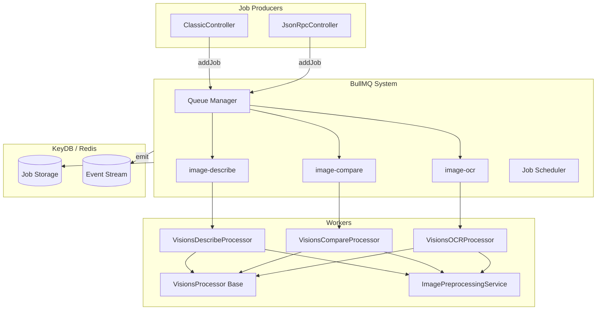
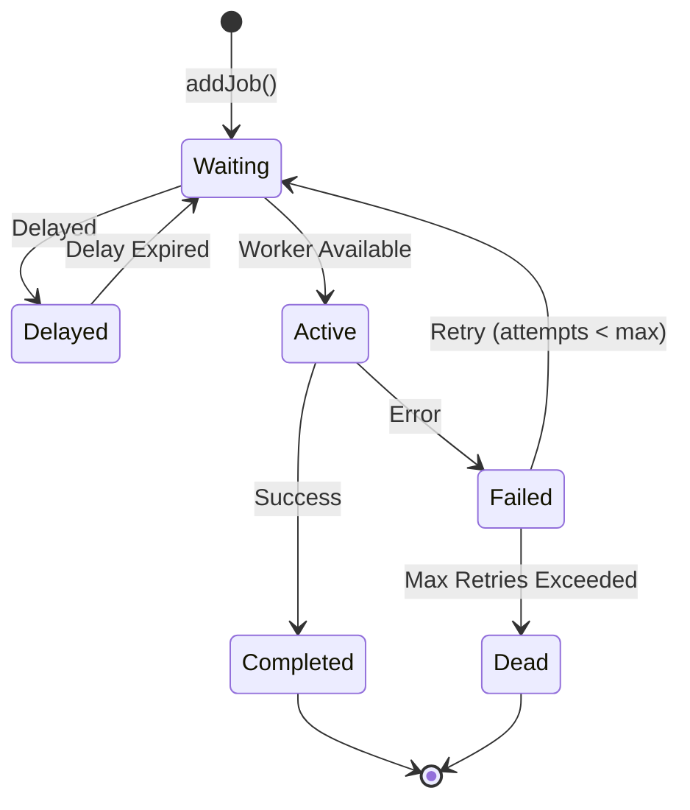

# 1.3 BullMQ Async Processing

## Architectural Rationale

Synchronous waiting on Ollama inference would block the Node.js event loop for seconds to minutes, depending on image size, model load state, and GPU availability. The system therefore adopts an **asynchronous command-bus pattern**: HTTP requests are accepted, validated, immediately acknowledged (`202 Accepted`), and delegated to BullMQ backed by Redis/KeyDB. Workers run in separate processes (conceptually) and emit results via Socket.IO as they become available.



## Queue Topology

| Queue Name | Task Enum | Processor | Concern |
|------------|-----------|-----------|---------|
| `describe` | `describe` | `VisionsDescribeProcessor` | Single-image or multi-image descriptive analysis |
| `compare` | `compare` | `VisionsCompareProcessor` | Cross-image similarity and delta detection |
| `ocr` | `ocr` | `VisionsOCRProcessor` | Text extraction with optional preprocessing enhancement |

Each queue is configured with identical retry, backoff, and retention policies through `BullmqConfigService`.

## Job Data Structure

```typescript
interface VisionJobPayload {
  meta: ImageMeta[];        // File metadata per image
  filters: {
    requestId: string;       // Correlation ID
    roomId?: string;        // Socket.IO room subscription
    stream?: boolean;       // Streaming mode flag
    vLLM: string;           // Target Ollama model tag
    task: VisionTask;       // 'describe' | 'compare' | 'ocr'
    prompt?: Prompt[];      // Optional user-provided prompt
    numCtx?: number;        // Context window override
    preprocessing?: ImagePreprocessingOptions;
  };
}

interface ImageMeta {
  name: string;
  type: string;
  hash: string;
  variant?: string;           // Set by ImagePreprocessingService inside worker
}
```

> **Note:** Image buffers are **not** stored in BullMQ. They are uploaded to MinIO before enqueueing, and the worker fetches them via `requestId` at dequeue time. This keeps Redis memory flat.

## Retry Strategy

BullMQ exponential backoff is configured with an initial delay of **10,000 ms** and a maximum of **3 attempts** (~70 s total window). Once all retries are exhausted, the job is persisted to a Postgres DLQ and removed from Redis.

| Attempt | Cumulative Delay | Rationale |
|---------|-----------------|-----------|
| 1 | 0 ms | Immediate first try |
| 2 | ~10 s | Brief backoff for transient network/GPU issues |
| 3 | ~30 s | Final attempt; after this the job is offloaded |

### Non-Retryable Failures

Certain failure classes bypass the retry mechanism via `UnrecoverableError`, preventing wasted cycles on deterministic failures:

| Failure | Source | Action |
|---------|--------|--------|
| `model not found` | OllamaService | Immediate fatal; client must select a different model |
| `invalid image format` | Sharp preprocessor | Immediate fatal; corrupted or unsupported MIME type |
| `job canceled` | JobTrackingService | Unrecoverable; worker terminates mid-stream |
| `socket emit failure` | SocketIOService | Logged but does not abort inference |

## Worker Architecture

### Base Processor: `VisionsProcessor`

All task processors extend an abstract `VisionsProcessor` that encapsulates common concerns:

```typescript
abstract class VisionsProcessor extends WorkerHost {
  protected async handleVision(
    buffers: Buffer[],
    filters: VisionFilters,
    onChunk?: (chunk: string) => void
  ): Promise<ChatResponse>;

  protected async emitToSocket(
    roomId: string,
    event: string,
    data: VisionResponse
  ): Promise<void>;
}
```

The base class manages:
- **Ollama `chat()` invocation** with streaming callback
- **Socket.IO emission** with null-safe adapter guards
- **Job cancellation polling** via `JobTrackingService.isCanceled()`
- **Worker event logging** via `@ehildt/nestjs-bullmq-logger`

### Task-Specific Implementations

```typescript
class VisionsDescribeProcessor extends VisionsProcessor {
  async process(job: Job): Promise<void> {
    const { meta, filters } = job.data;
    const buffers = await this.fetchBuffers(job.name);   // MinIO
    this.validateInput(meta);
    const systemPrompt = this.config.systemPrompts.DESCRIBE;

    await this.handleVision(buffers, filters, (chunk) => {
      this.emitToSocket(filters.roomId, filters.event, {
        meta, task: 'describe',
        message: { role: 'assistant', content: chunk },
        done: false
      });
    });
  }
}
```

Each subclass injects its own system prompt (defined in `OllamaConfigService.systemPrompts`) and task identifier but reuses the streaming loop and cancellation logic from the base class.

## `keep_alive` Mapping

The `OllamaConfigService` returns the `keepAlive` property in camelCase per TypeScript convention. The `VisionsProcessor` maps this to `keep_alive` (snake_case) when building the Ollama `chat()` request payload:

```typescript
return {
  messages,
  options: { num_ctx: filters.numCtx },
  stream: filters.stream,
  model: filters.vLLM,
  keep_alive: this.ollamaConfigService.config.keepAlive,
};
```

This indirection isolates the internal configuration schema from external SDK expectations, allowing future Ollama API version upgrades without cascading breaking changes.

## Job Lifecycle



| State | Transitions | Observable Events |
|-------|------------|-------------------|
| `waiting` | `addJob()` | `queue.on('waiting')` |
| `active` | Worker pickup | `queue.on('active')` |
| `completed` | Success | `queue.on('completed')` |
| `failed` | Error, retryable | `queue.on('failed')` |
| `delayed` | Backoff expiry | `queue.on('delayed')` |

## Job Events

The `BullMQLoggerService` subscribes to worker events to emit structured logs. Because `removeOnComplete` and `removeOnFail` immediately purge the job from Redis, `job.getState()` returns `"unknown"` if called after cleanup. We therefore pass the state **explicitly** to the logger:

```typescript
@OnWorkerEvent('active')
protected async onActive(job) {
  await this.bullMQLogger.log(job, 'active');
  this.jobTracking.setActive(job.name);
}

@OnWorkerEvent('completed')
protected async onCompleted(job) {
  await this.bullMQLogger.log(job, 'completed');
  await this.minioService.deleteBuffers(job.name);  // clean up MinIO
  this.jobTracking.remove(job.name);
}

@OnWorkerEvent('failed')
protected async onFailed(job) {
  const failedReason = (job as any).failedReason || '';
  if (failedReason.includes('canceled'))
    await this.bullMQLogger.log(job, 'canceled');
  else
    await this.bullMQLogger.error(job, 'failed');

  // Persist DLQ record (buffers already in MinIO)
  await this.postgresService.upsert(job.name, {
    queueName: job.queueName,
    status: 'PENDING_RETRY',
    failedAt: new Date(),
    attemptsMade: job.attemptsMade,
    nextRetryAt: new Date(Date.now() + FAILED_JOB_RETRY_DELAY_MS),
    payload: job.data,
  });

  this.jobTracking.remove(job.name);
}
```

## Configuration Reference

```yaml
BULLMQ_HOST: keydb
BULLMQ_PORT: 6379
BULLMQ_USER: default
BULLMQ_PASS: redis
BULLMQ_JOB_ATTEMPTS: 3
BULLMQ_BACKOFF_TYPE: exponential
BULLMQ_BACKOFF_DELAY: 10000
BULLMQ_WORKER_CONCURRENCY: 3        # Per-processor concurrency
```

> **Note:** `removeOnComplete` and `removeOnFail` are hardcoded to `{ count: 1, age: 0 }` in `BullMQConfigAdapter`. This intentionally deletes jobs from Redis immediately upon completion/failure, since:
- Completed jobs clean up MinIO buffers right away.
- Failed jobs are persisted to the Postgres DLQ before Redis cleanup.

Retry automation is driven by new DLQ env vars:

| Variable | Default | Description |
|----------|---------|-------------|
| `FAILED_JOB_RETRY_DELAY_MS` | `300000` | Minimum delay before a failed job becomes eligible for reinstate |
| `FAILED_JOB_REINSTATE_BATCH_SIZE` | `10` | Max jobs re-inserted per `POST /api/v1/jobs/reinstate` call |

## Buffer Offloading to MinIO

Image buffers are **never** stored in Redis. Instead, `AnalyzeImageService.emit()` uploads them to MinIO via `minioService.uploadBuffers(requestId, buffers)` and queues only `{ meta, filters }`:

```typescript
const payload: VisionJobPayload = {
  meta: req.meta,
  filters: req.filters,
};
await queue.add(requestId, payload);
```

Buffers are fetched inside the worker:

```typescript
const buffers = await this.minioService.downloadBuffers(requestId);
```

On success, `onCompleted` calls `minioService.deleteBuffers(requestId)` to clean up. On failure, buffers remain in MinIO until the DLQ job is either reinstated (worker re-uses the same buffers) or manually deleted.

This design removes Redis bloat entirely and eliminates `Buffer` JSON serialization/deserialization from BullMQ.

## Performance Considerations

| Metric | Impact | Mitigation |
|--------|--------|------------|
| Memory per worker | Holds image buffers + preprocessing variants | Limit concurrency; resize before enqueue |
| GPU contention | Multiple queues share one Ollama instance | Tune `keep_alive` to prevent model eviction |
| Redis latency | Job state transitions | Co-locate KeyDB within the same datacenter |
| Cold start | First job after idle loads model to GPU | Pre-warm via health check pings if budget allows |

## Scaling Workers

Horizontal scaling follows this model:

| Queue | Suggested Concurrency | Rationale |
|-------|-------------------|-----------|
| `describe` | 2 | Lightweight, CPU-bound description |
| `compare` | 1 | GPU-intensive multi-image inference |
| `ocr` | 2 | Fast processing with optional preprocessing overhead |

Concurrency is configured via `@ehildt/nestjs-bullmq` queue registration:

```typescript
QueueProcessor.forRoot({
  queues: [
    { name: 'describe', processors: [{ path: './describe.processor', concurrency: 2 }] },
    { name: 'compare', processors: [{ path: './compare.processor', concurrency: 1 }] },
  ],
});
```

## Related Documentation

- [1.1 REST Interfaces](1.1-rest.md) — Queue producer via REST
- [1.2 MCP Interfaces](1.2-mcp.md) — Queue producer via MCP
- [1.5 Image Preprocessing Pipeline](1.5-image-preprocessing.md) — Preprocessing before enqueueing
