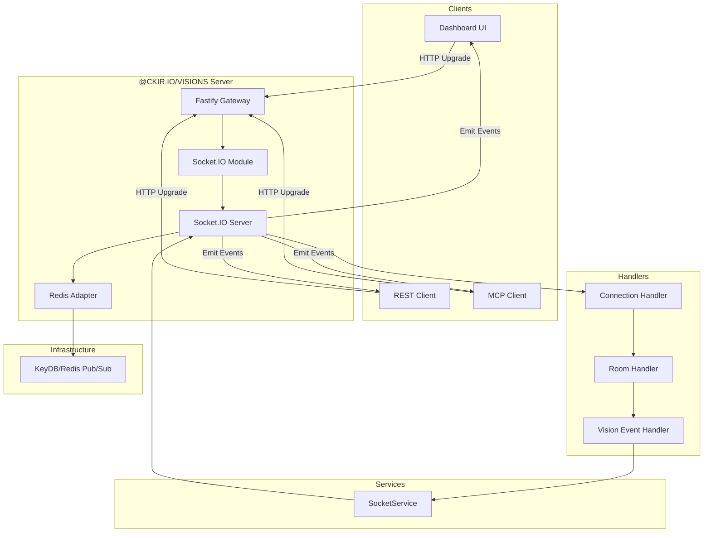
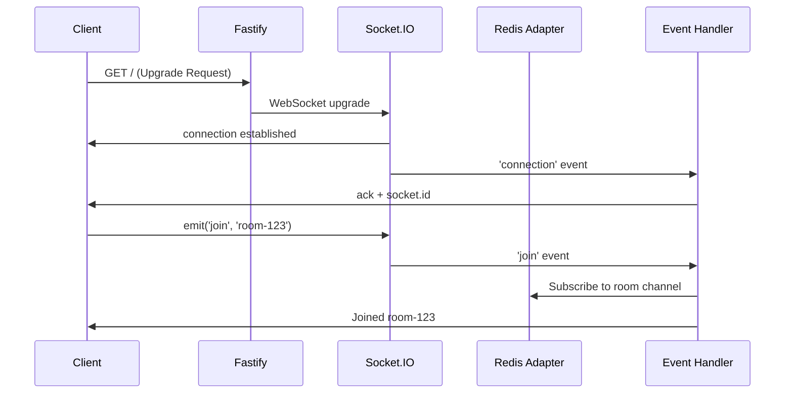
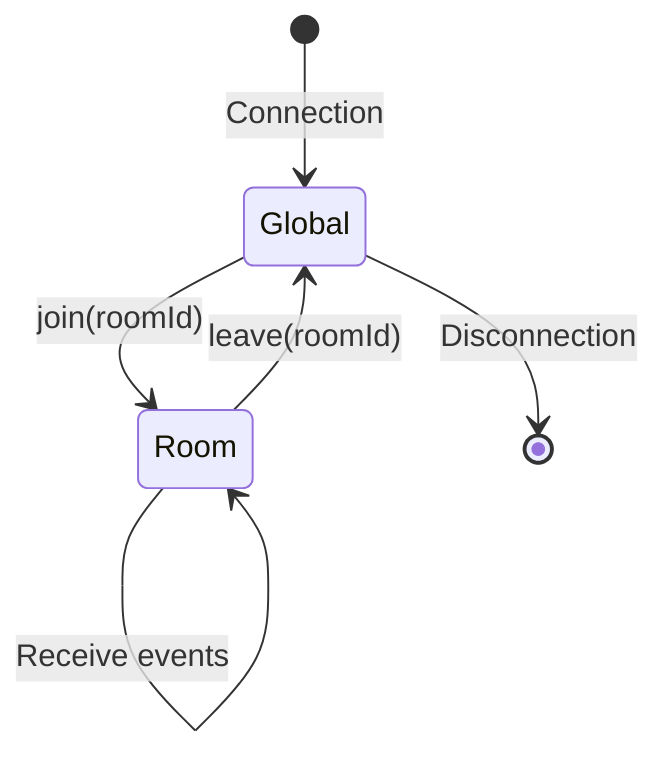
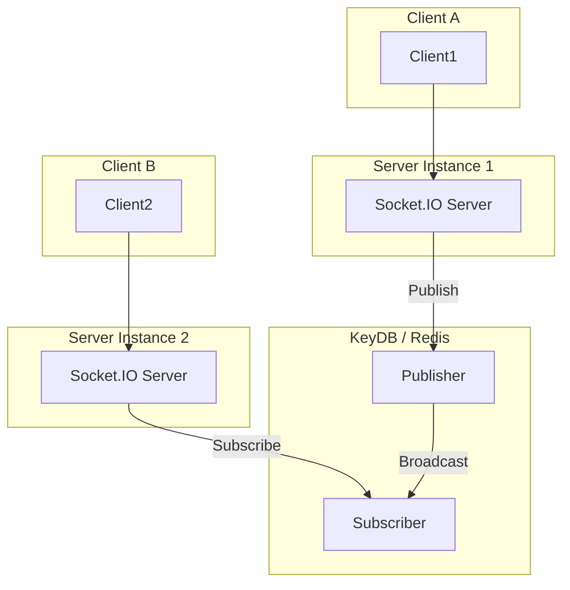
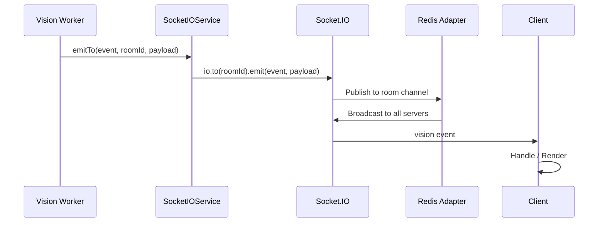

# 1.4 Socket.IO Real-time Layer

## Architectural Rationale

The system separates request ingestion (HTTP) from result delivery (WebSocket) to avoid keeping long-running HTTP connections alive during Ollama inference. Socket.IO is attached to the same Fastify listener (port 3000) via `SocketIOModule.attach(APP)`, sharing the TLS certificate and CORS configuration while maintaining distinct event namespaces. A Redis adapter is configured for horizontal scaling, enabling cross-server room broadcast without session affinity requirements.



## Server Configuration

```typescript
// Conceptual configuration via @ehildt/nestjs-socket.io
SocketIOModule.forRoot({
  cors: {
    origin: process.env.CORS_ORIGIN,
    credentials: true,
  },
  transports: ['websocket', 'polling', 'webtransport'],
  adapter: createAdapter(pubClient, subClient), // Redis adapter
});
```

| Parameter | Default | Semantics |
|-----------|---------|-----------|
| `transports` | `websocket,polling,webtransport` | Fallback chain; polling ensures connectivity through restrictive proxies |
| `cors.origin` | `*` | Allowlist; overridden in production by `CORS_ORIGIN` |
| `cors.credentials` | `true` | Required for Cookie-based auth (future-proofing) |
| `pingInterval` | `25000` | Server heartbeat interval (ms) |
| `pingTimeout` | `5000` | Client considered disconnected after this timeout |

## Connection Flow



## Event System

### Built-in Events

| Event | Direction | Trigger |
|-------|-----------|---------|
| `connect` | Server → Client | Underlying transport established |
| `disconnect` | Server → Client | Transport closed or heartbeat timeout |
| `connect_error` | Server → Client | Handshake or authentication failure |

### Application Events

| Event | Direction | Payload | Semantics |
|-------|-----------|---------|-----------|
| `join` | Client → Server | `{ roomId: string }` | Subscribe to a room; used for result isolation |
| `leave` | Client → Server | `{ roomId: string }` | Unsubscribe from a room |
| `cancel` | Client → Server | `{ requestId: string }` | Signal cancellation intent |
| `cancel_result` | Server → Client | `{ requestId, success: boolean }` | Acknowledge cancellation (success = true if job found and marked, false if already completed/not found)

### Configurable Result Event

The result event name is configurable via `SOCKET_IO_EVENT` (default: `vision`). This allows multiple service instances or tenants to share the same Socket.IO server without interleaved payloads.

```typescript
interface VisionResponse {
  meta: ImageMeta[];
  task: 'describe' | 'compare' | 'ocr';
  message: { role: 'assistant'; content: string };
  done?: boolean;        // Streaming sentinel
  canceled?: boolean;    // Cancellation marker
  status?: string;       // 'completed' | 'failed' | 'canceled'
}

interface ImageMeta {
  name: string;
  type: string;
  hash: string;
  requestId: string;
  variant?: string;
}
```

## Room Management

### Room Lifecycle



### Room Naming Convention

Rooms are derived from `requestId` to guarantee isolation:

```typescript
const roomId = filters.roomId ?? `vision-${filters.requestId}`;
socket.join(roomId);
```

This design prevents cross-talk between concurrent requests, even when originating from the same client.

## Scaling with Redis Adapter



### Benefits

| Capability | Mechanism |
|------------|-----------|
| Cross-server communication | Redis pub/sub channel per room |
| Room synchronization | Room membership stored in shared Redis state |
| Session affinity independence | Clients can reconnect to any server instance |
| Horizontal elasticity | New server instances auto-subscribe on join events |

## Result Delivery: Vision Event Flow



### Streaming Mode

In streaming mode, the worker emits multiple progressive `vision` events:

```
Event 1: { content: "The image", done: false }
Event 2: { content: "The image shows", done: false }
Event 3: { content: "The image shows a cat...", done: true }
```

The `done: true` sentinel signals the final chunk. Clients should concatenate intermediate chunks while rendering.

### Non-Streaming Mode

A single event with the complete `content` string and no `done` field:

```
Event: { content: "The image shows a cat sitting...", done: undefined }
```

## Error Handling

### Connection Errors

```typescript
socket.on('connect_error', (error) => {
  this.logger.error('Connection error:', error);
  // Retry logic via exponential backoff
});
```

### Cancellation Flow

Cancel requests are handled via the `cancel` Socket.IO event or `POST /api/v1/vision/cancel`. The `JobTrackingService` atomically marks the request as canceled. Active workers poll this flag during the Ollama streaming loop:

```typescript
if (this.jobTracking.isCanceled(requestId)) {
  await this.emitToSocket(roomId, event, { requestId, status: 'canceled', canceled: true });
  throw new UnrecoverableError('Job canceled during streaming');
}
```

## Security

### CORS Configuration

CORS is shared between Fastify and Socket.IO via a unified configuration object:

```typescript
APP.enableCors(appConfigService.config.cors);
// CORS_ORIGIN=http://localhost:5173
```

### Room Isolation

- Wildcard room subscriptions are prohibited
- Room IDs are derived from UUID-based `requestId` values, making enumeration impractical
- No room listing API is exposed

## Environment Variables

| Variable | Default | Description |
|----------|---------|-------------|
| `SOCKET_IO_EVENT` | `vision` | Primary result event name |
| `SOCKET_IO_TRANSPORTS` | `websocket,polling,webtransport` | Allowed transports |
| `SOCKET_IO_PING_INTERVAL` | `25000` | Heartbeat interval (ms) |
| `SOCKET_IO_PING_TIMEOUT` | `5000` | Heartbeat timeout (ms) |
| `SOCKET_IO_CORS_ORIGIN` | `*` | Allowed origins |
| `SOCKET_IO_CORS_CREDENTIALS` | `true` | Allow credentials |
| `CORS_ORIGIN` | `*` | Shared CORS origin (prefer `SOCKET_IO_CORS_ORIGIN`) |

## Client Configuration Example

```typescript
import { io } from 'socket.io-client';

const socket = io('http://localhost:3000', {
  transports: ['websocket', 'polling'],
  reconnection: true,
  reconnectionAttempts: 5,
  reconnectionDelay: 1000,
});

socket.emit('join', 'room-123');
socket.on('vision', (data: VisionResponse) => {
  if (data.done) console.log('Complete:', data.message.content);
  else console.log('Chunk:', data.message.content);
});
```

## Monitoring Metrics

| Metric | Measurement Point |
|--------|-------------------|
| Connected clients | `io.sockets.sockets.size` (with Redis: `io.of('/').adapter.sidsCount`) |
| Active rooms | `io.of('/').adapter.roomsCount` |
| Events per second | Custom counter in `SocketService` |
| Reconnection rate | Client-side `reconnect` event frequency |

## Troubleshooting

| Symptom | Cause | Resolution |
|---------|-------|------------|
| Connection refused | Server down or port misconfigured | Verify `PORT` and firewall rules |
| CORS errors | Origin mismatch | Check `CORS_ORIGIN` against client URL |
| Events not received | Room mismatch or wrong event name | Verify `roomId` matches between request and `join` event |
| High latency | Redis connection across WAN | Co-locate KeyDB with API servers |

## Related Documentation

- [1. Server Overview](1-server.md) — Integration with Fastify
- [1.3 BullMQ Async Processing](1.3-bullmq.md) — Worker emission to Socket.IO
- [2.3 Dashboard State Management & Real-time Events](2.3-state-and-realtime.md) — Client-side consumption
