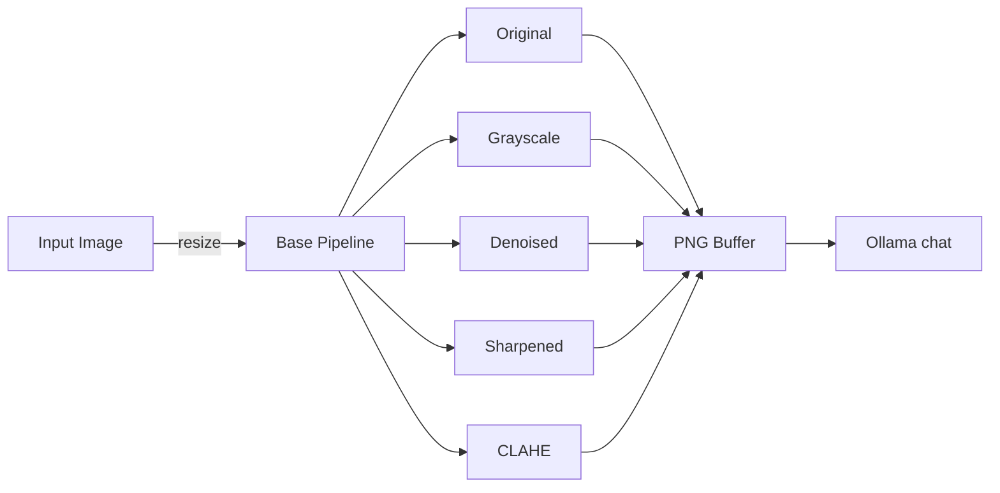
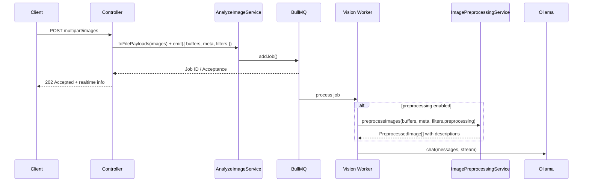

# 1.5 Image Preprocessing Pipeline

## Motivation

Vision-language models (VLMs) operating via Ollama are sensitive to image quality, contrast distribution, and noise levels. Direct inference on unprocessed images often yields suboptimal results for OCR tasks, low-light photography, and fine-grained detail extraction. The preprocessing layer applies a sequence of deterministic image transformations to generate multiple per-image variants that collectively expose the model to complementary visual cues—grayscale luminance structure, Gaussian-blurred noise reduction, edge-sharpened boundaries, and local contrast enhancement (CLAHE)—improving recognition accuracy without increasing model parameter count or inference cost.

## Pipeline Architecture



Each variant is generated from a **cloned Sharp pipeline** (`basePipeline.clone()`) to prevent state mutation across concurrent transformations. All variants are PNG-encoded before transmission to Ollama to ensure consistent pixel representation across model runtimes.

## Variant Taxonomy

| Variant | Transformation | Description | Optimal Task |
|---------|---------------|-------------|--------------|
| `original` | Resize only | Baseline reference with aspect-ratio-preserving downsampling | `describe`, `compare` |
| `grayscale` | `grayscale()` | Luminance-channel isolation; removes chromatic noise and highlights structural geometry | All tasks |
| `denoised` | `grayscale().blur(sigma)` | Gaussian blur applied after grayscale conversion; suppresses high-frequency noise and compression artifacts | `ocr`, low-light images |
| `sharpened` | `sharpen({ sigma, m1, m2 })` | Edge enhancement via unsharp masking parameters; improves text boundary discrimination | `ocr`, fine-detail analysis |
| `clahe` | `grayscale().clahe({ width, height, maxSlope })` | Contrast-Limited Adaptive Histogram Equalization; improves local contrast in heterogeneous lighting | `ocr`, uneven illumination |

## Variant Descriptions Sent to the LLM

Each variant description is appended to the prompt so the model understands the semantic intent of each image:

```typescript
export const VARIANT_DESCRIPTIONS = {
  original: 'original - baseline image at reduced resolution',
  grayscale: 'grayscale - luminance only, removes color noise to focus on text structure',
  denoised: 'denoised - background smoothed with Gaussian blur to reduce noise and artifacts',
  sharpened: 'sharpened - edges enhanced for improved text clarity and boundary definition',
  clahe: 'CLAHE - adaptive contrast enhancement that brings out details in both bright and dark areas',
};
```

These descriptions are injected into the user message content via `buildChatRequest()`, allowing the model to differentially weight variant contributions:

```
Image(s): photo.jpg
Image variants provided: 0: original - baseline image at reduced resolution 1: grayscale - luminance only...
```

## Sharp Configuration and Parameters

### Default Options

```typescript
export const DEFAULT_PREPROCESSING_OPTIONS = {
  enabled: false,
  resize: {
    maxWidth: 768,
    maxHeight: undefined,
    withoutEnlargement: true,
    fit: 'inside',
  },
  variants: {
    original: true,
    grayscale: true,
    denoised: true,
    sharpened: false,
    clahe: true,
  },
  parameters: {
    blurSigma: 0.5,
    sharpenSigma: 1,
    sharpenM1: 1,
    sharpenM2: 2,
    contrastLevel: 1.3,
    brightnessLevel: 1.2,
    claheWidth: 8,
    claheHeight: 8,
    claheMaxSlope: 3,
    normalizeLower: 1,
    normalizeUpper: 99,
  },
};
```

### Resize Constraints

| Property | Type | Default | Range | Description |
|----------|------|---------|-------|-------------|
| `maxWidth` | `number` | `768` | `256, 384, 512, 640, 768, 1024` | Maximum width in pixels |
| `maxHeight` | `number \| null` | `null` | Any positive integer | Maximum height; preserves aspect ratio if `null` |
| `withoutEnlargement` | `boolean` | `true` | — | Prevents upscaling images smaller than target dimensions |
| `fit` | `string` | `'inside'` | — | Scales while maintaining aspect ratio within bounding box |

### CLAHE Parameters

| Parameter | Type | Default | Description |
|-----------|------|---------|-------------|
| `claheWidth` | `number` | `8` | Tile grid width for localized histogram equalization |
| `claheHeight` | `number` | `8` | Tile grid height |
| `claheMaxSlope` | `number` | `3` | Contrast limit; higher values amplify local contrast more aggressively |

## Service Implementation

```typescript
// ImagePreprocessingService (excerpt)
async preprocessImages(
  buffers: Buffer[],
  meta: FastifyMultipartMeta[],
  options?: ImagePreprocessingOptions
): Promise<PreprocessedImage[]> {
  const realBuffers = buffers.map(b => this.ensureBuffer(b));
  const mergedOptions = mergePreprocessingOptions(options);

  if (!mergedOptions.enabled)
    return this.processOriginalsOnly(realBuffers, meta, mergedOptions);

  const results: PreprocessedImage[] = [];
  for (let i = 0; i < realBuffers.length; i++) {
    try {
      const variants = await this.createVariants(realBuffers[i], meta[i], mergedOptions);
      results.push(...variants);
    } catch (error) {
      this.logger.error(`Failed to preprocess image ${meta[i].name}:`, error);
      results.push(await this.createOriginalVariant(realBuffers[i], meta[i], mergedOptions));
    }
  }
  return results;
}
```

### Error Resilience

If any variant generation fails, the service **gracefully degrades** to the original resized buffer rather than failing the entire request. This fault-tolerance pattern is critical because Sharp may throw on malformed image headers or unsupported color profiles. The fallback behavior ensures that inference proceeds even with degraded input quality.

### Parallel Variant Generation

```typescript
const variantPromises: Promise<PreprocessedImage>[] = [];
if (variantOptions.original) variantPromises.push(/* ... */);
if (variantOptions.grayscale) variantPromises.push(/* ... */);
// ... denoised, sharpened, clahe
const results = await Promise.all(variantPromises);
```

Variant pipelines execute in parallel via `Promise.all`, bounded only by the Node.js thread pool and Sharp's internal libvips worker scheduling. The base pipeline is cloned for each branch to prevent cross-contamination of state (e.g., grayscale mutation leaking into the original variant).

## Expected Benefits

| Task | Preprocessing Strategy | Expected Improvement |
|------|----------------------|---------------------|
| **OCR** | `grayscale + clahe + sharpened` | Text region localization and character boundary definition |
| **Description** | `original + grayscale + denoised` | Reduced chromatic noise; improved object silhouette detection |
| **Comparison** | `original + grayscale` | Stable luminance feature matching across varying color temperatures |
| **Low-light** | `clahe + denoised` | Local contrast recovery without amplifying sensor noise |
| **Document scan** | `clahe + sharpened + grayscale` | Adaptive enhancement of unevenly lit pages |

## Performance Impact

| Dimension | Impact | Notes |
|-----------|--------|-------|
| Processing latency | +20–80 ms per variant | Parallelized per image; scales sub-linearly with core count |
| Memory overhead | 1× buffer per variant | Transient; buffers are eligible for GC after queue insertion |
| Network bandwidth | 5× payload if all variants enabled | PNG encoding is lossless; consider JPEG for transfer if quality allows |
| Inference time | Neutral to +10% | More images per prompt marginally increase token generation time |

## Clinical Comparison: With vs Without Preprocessing

| Scenario | Without Preprocessing | With CLAHE + Grayscale |
|----------|----------------------|------------------------|
| Dark image with text | Model hallucinates or omits text regions | Text becomes legible; OCR accuracy improves significantly |
| Noisy photograph | Background artifacts distract object detection | Gaussian blur isolates subject from noise |
| High-contrast document | Overexposed regions lose detail | CLAHE preserves detail in both bright and shadow areas |

## Integration Points

The preprocessing service is injected into each BullMQ worker (`VisionsDescribeProcessor`, `VisionsCompareProcessor`, `VisionsOCRProcessor`) rather than being called by `AnalyzeImageService` during HTTP request handling. This placement ensures that:

1. **HTTP latency remains minimal** — the controller enqueues raw buffers without CPU-intensive image processing
2. **Worker-side preprocessing is context-aware** — workers access the preprocessed variant descriptions directly for prompt construction
3. **Queue serialization overhead is reduced** — only original image buffers travel through Redis; variant generation occurs at dequeue time, not enqueue time



## Configuration via REST vs MCP

| Parameter | REST (query) | MCP (`arguments.preprocessing`) | Type |
|-----------|-------------|-----------------------------------|------|
| Enable toggle | `pproc_enabled` | `enabled` | `boolean` |
| Resize width | `pproc_resize_maxWidth` | `resize.maxWidth` | `number` |
| Denoising | `pproc_denoised` | `variants.denoised` | `boolean` |
| Sharpening | `pproc_sharpened` | `variants.sharpened` | `boolean` |
| CLAHE width | `pproc_claheWidth` | `parameters.claheWidth` | `number` |

## Related Documentation

- [1.1 REST Interfaces](1.1-rest.md) — Preprocessing query parameter mapping
- [1.2 MCP Interfaces](1.2-mcp.md) — MCP argument nesting
- [1.3 BullMQ Async Processing](1.3-bullmq.md) — Worker-side buffer consumption
