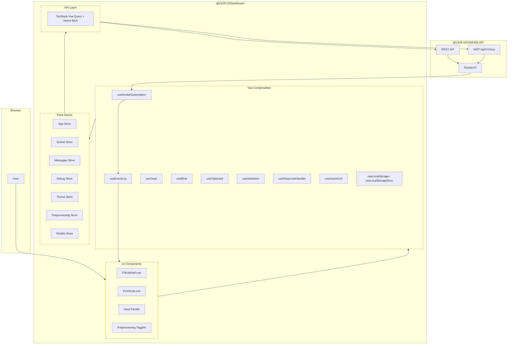

# 2. Dashboard Overview

## Purpose

The dashboard is a Vue 3 single-page application (SPA) that serves as both a **developer debugging console** and a **user-facing interface** for the VISIONS API. It provides real-time visualization of inference streams, request/response inspection, theme customization, and direct interaction with all three server layers: REST, MCP, and Socket.IO. The dashboard is served independently on port 5173 in development; in production it is built as a set of static assets and served by a reverse proxy or CDN.

## Technology Stack

| Concern | Technology | Version | Rationale |
|---------|-----------|---------|-----------|
| Framework | Vue 3 Composition API | 3.4+ | Fine-grained reactivity, TypeScript-native |
| Bundler | Vite | 5+ | Rapid HMR, optimized tree-shaking |
| Styling | Tailwind CSS | v4 | Utility-first CSS with CSS-native `@theme` |
| State Management | Pinia | 2.1+ | Type-safe stores with `setup()` syntax |
| Server State | TanStack Vue Query | 5+ | Request deduplication, caching, background refetch |
| Real-time | Socket.IO Client | 4+ | Shared Socket.IO namespace with server |
| Icons | Lucide Vue Next | — | Tree-shakeable icon set |
| Notifications | vue3-toastify | — | Non-blocking toast system |

## Dashboard Topology



## Functional Panels

| Panel | Route / Tab | Purpose |
|-------|------------|---------|
| **REST Request** | `<RestPanel>` | Form-based submission to `/api/v1/vision` with file upload, field inputs, and query parameters |
| **MCP Request** | `<McpPanel>` | JSON-RPC payload builder for `tools/call` with base64 image attachment |
| **Debug/Event Log** | `<DebugPanel>` | Real-time event stream, health check status, request/response inspection |
| **Preprocessing** | `<PreprocessingPanel>` | UI for toggling variants and tuning Sharp parameters |

## Environment Configuration

| Variable | Required | Example | Description |
|----------|----------|---------|-------------|
| `VITE_API_URL` | Yes | `http://localhost:3000` | REST API base URL |
| `VITE_SOCKET_URL` | Yes | `http://localhost:3000` | Socket.IO server URL (same host:port as API) |

Variables must be prefixed with `VITE_` to be exposed to client-side code. CORS on the server must permit the dashboard origin (e.g., `http://localhost:5173`).

## Directory Structure

```
dashboard/src/
├── api/
│   ├── mutations/
│   │   ├── use-vision.mutation.ts
│   │   ├── use-vision.mutation.type.ts
│   │   ├── use-mcp.mutation.ts
│   │   ├── use-mcp.mutation.type.ts
│   │   ├── use-cancel-vision.mutation.ts
│   │   └── use-cancel-vision.mutation.type.ts
│   ├── queries/
│   │   ├── use-health-ready.query.ts
│   │   ├── use-health-ready.query.type.ts
│   │   ├── use-health-live.query.ts
│   │   ├── use-health-live.query.type.ts
│   │   ├── use-models.query.ts
│   │   └── use-models.query.type.ts
│   └── api-url.ts
├── assets/
│   └── css/
│       ├── animations.css
│       ├── colors.css
│       ├── style.css
│       ├── toast.css
│       └── themes/
│           ├── souls.css
│           ├── diablo.css
│           ├── gothic.css
│           ├── cyberpunk.css
│           ├── stellar.css
│           ├── ghostwire.css
│           ├── deathspace.css
│           ├── nioh.css
│           └── pragmata.css
├── components/
│   ├── app/              # AppHeader, AppFooter, AppThemeSwitcher, AppMainContent, TabButton
│   ├── buttons/          # ActionButton, ClearButton, FilterButton, RefreshButton
│   ├── drop-down/        # DropDown, DropDown.Field, DropDown.Select
│   ├── event-log/        # EventLog
│   ├── file-upload/      # FileUpload, FileUpload.Field, FileUpload.Files, FileUpload.Input, FileUpload.Label
│   ├── inputs/           # Form fields: PromptField, ModelField, TaskField, StreamField, RequestIdField, NumCtxField, MethodField, JsonField, MaxWidthField, MaxHeightField, BlurSigmaInput, SharpenSigmaInput, SharpenM1Input, SharpenM2Input, BrightnessInput, ClaheWidthInput, ClaheHeightInput, ClaheMaxSlopeInput, NormalizeLowerInput, NormalizeUpperInput, SubmitButton
│   ├── preprocessing/    # PreprocessingMasterToggle, PreprocessingParamTile, PreprocessingSection, PreprocessingToggleButton
│   ├── socket-subscriber/# SocketPanel, subscription controls
│   ├── ui/               # ActionTagButton, PanelHeader, and other base primitives
│   └── toast/            # Toast customization
├── composables/
│   ├── use-blink.ts
│   ├── use-debounced-loading.ts
│   ├── use-clipboard.ts
│   ├── use-event-log.ts
│   ├── use-local-storage.ts
│   ├── use-local-storage-sync.ts
│   ├── use-response-handler.ts
│   ├── use-socket-subscription.ts
│   ├── use-toast.ts
│   ├── use-validation.ts
│   └── use-auto-scroll.ts
├── panels/
│   ├── debug/            # DebugPanel, DebugPanel.Health, DebugPanel.Details, DebugPanel.Layout, DebugPanel.Header, DebugPanel.EmptyState
│   ├── mcp/              # McpPanel, McpPanel.RequestPanel, use-mcp-panel
│   ├── preprocessing/    # PreprocessingPanel.OptionsPanel, PreprocessingPanel.ToolsPanel
│   ├── rest/             # RestPanel, RestPanel.RequestPanel, use-rest-panel
│   └── socket/           # SocketPanel for manual event inspection
├── stores/
│   ├── app.ts            # Global UI state (active tab, request IDs, abort)
│   ├── debug.ts          # Debug panel state, filters, result history
│   ├── debug.helper.ts   # Debug result formatting helpers
│   ├── messages.ts       # Persistent message queue (rest + mcp instances)
│   ├── models.ts         # Fetched Ollama models list
│   ├── preprocessing.ts  # Variant selection, parameter values, localStorage sync
│   ├── socket.ts         # Socket connection, rooms, events
│   └── theme.ts          # Active theme, theme colors, persistence
├── types/
│   ├── debug.model.ts
│   ├── message.model.ts
│   └── socket-provider.model.ts
└── utils/
    ├── colors/           # Semantic color helpers (method, status, tag colors)
    ├── formatting.helper.ts
    ├── http.helper.ts
    ├── id.helper.ts
    ├── message-data.helper.ts
    └── promise.helper.ts
```

## Communication Patterns

### 1. REST Request → Socket.IO Stream

```
User selects files → RestPanel emits mutation
    → POST /api/v1/vision (202 Accepted)
    → Response contains { realtime: { event, roomId, requestId } }
    → Dashboard joins room via Socket.IO
    → Server streams vision events to room
    → Dashboard renders progressive responses
```

### 2. MCP Request Flow

```
User builds JSON-RPC payload in McpPanel
    → POST /api/v1/mcp with payload + images
    → Response contains realtime info
    → Same Socket.IO subscription as REST
```

### 3. Event Log Inspection

```
All socket events captured by useEventLog()
    → Timestamp, event type, payload size, origin
    → Filterable by type (request / response / error / system)
    → Auto-scroll with pause-on-interaction
```

## Build and Development

```bash
# Development server (port 5173)
cd dashboard && pnpm run dev

# Production build
cd dashboard && pnpm run build       # vue-tsc -b && vite build

# Testing
cd dashboard && pnpm run test          # Vitest run, jsdom environment
cd dashboard && pnpm run coverage    # Coverage report
```

## Browser Support

| Feature | Minimum Version | Fallback |
|---------|----------------|----------|
| WebSocket | Chrome 90+, Firefox 88+ | Socket.IO polling transport |
| ES2020 | All modern evergreen | Vite transpiles to target |
| CSS Grid/Flexbox | All modern evergreen | N/A (layout critical) |
| `localStorage` | All modern evergreen | Theme defaults to `souls` |

## Related Documentation

- [2.1 Frontend Architecture](2.1-architecture.md) — Component hierarchy, composables, API layer
- [2.2 Color Harmony & Theming](2.2-color-harmony.md) — 9 dark themes, Tailwind v4 theme system
- [2.3 State Management & Real-time Events](2.3-state-and-realtime.md) — Pinia stores, Socket.IO lifecycle, event log
