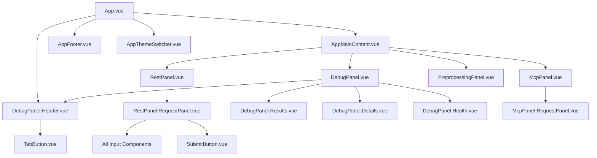
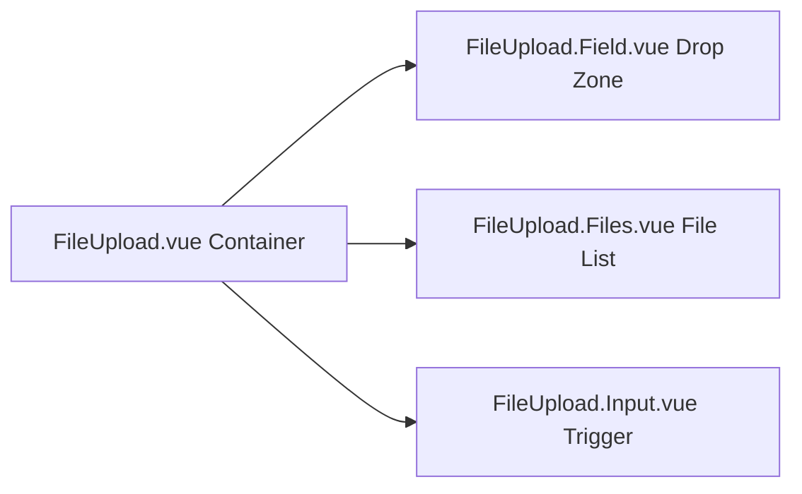
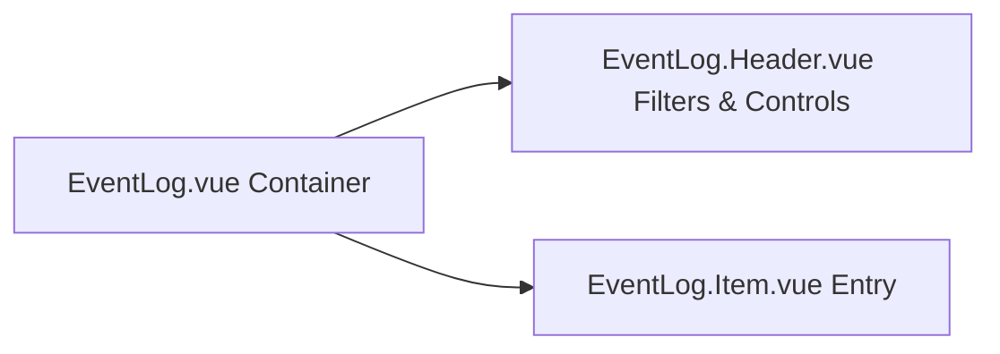

# 2.1 Frontend Architecture

## Framework Paradigm

The dashboard is built on the **Vue 3 Composition API** with `<script setup>` syntax. All reactive state is declared via `ref()`, `computed()`, and `watch()` rather than the Options API, enabling colocation of related logic and improving tree-shaking granularity. TypeScript strict mode is enforced; all props, emits, and store state are fully typed.

## Component Hierarchy



## Component Design Philosophy

### Atomic Components

Base UI primitives live in `src/components/ui/` and provide consistent styling hooks:

| Component | Responsibility | Tailwind Classes |
|-----------|---------------|-----------------|
| `BaseButton.vue` | Button styles, states, accessibility | `inline-flex items-center justify-center rounded` |
| `InputText.vue` | Text input with label, error state | `border-divider bg-bg-secondary text-fg-primary` |
| `InputSelect.vue` | Dropdown with options | `appearance-none bg-bg-secondary` |
| `InputNumber.vue` | Numeric stepper | `tabular-nums font-mono` |
| `PanelHeader.vue` | Section header with icon slot | `border-b border-divider` |
| `UiTag.vue` | Status and category badges | `px-2 py-0.5 rounded text-xs font-mono` |

### Composable Patterns

Logic is extracted into Vue composables rather than mixins or global properties:

```typescript
// use-socket-subscription.ts (conceptual)
export function useSocketSubscription() {
  const socketStore = useSocketStore();
  const events = ref&lt;VisionEvent[]&gt;([]);

  function subscribe(eventName: string, roomId: string) {
    socketStore.joinRoom(roomId);
    socketStore.socket?.on(eventName, (payload) => events.value.push(payload));
  }

  function unsubscribe(eventName: string) {
    socketStore.socket?.off(eventName);
  }

  return { events, subscribe, unsubscribe };
}
```

All composables follow the **single-responsibility principle**:

| Composable | Concern | State |
|-----------|---------|-------|
| `useSocketSubscription` | Connect, join, leave, event accumulation | `events`, `connected`, `error` |
| `useEventLog` | Add, clear, filter logs; auto-scroll | `logs`, `filters`, `isAutoScroll` |
| `useToast` | Display transient notifications | `queue`, `dismiss` |
| `useBlink` | Visual pulse on state change | `isBlinking`, `trigger()` |
| `useDebouncedLoading` | Delayed loading indicator to prevent flicker | `isLoading`, `start()`, `stop()` |
| `useLocalStorage` / `useLocalStorageSync` | Typed `localStorage` sync | `value`, `persist()` |
| `useClipboard` | Copy to clipboard with timeout | `copy(text)` |
| `useValidation` | Connection and required-field checks | `validateConnection()`, `requireModel()`, `requireFiles()` |
| `useResponseHandler` | HTTP response + Socket.IO join logic | `handleResponse()` |
| `useAutoScroll` | Scroll-to-bottom on trigger change | `scrollRef`, watches trigger |

## API Layer Design

### TanStack Vue Query Integration

Server state is managed via TanStack Vue Query (`@tanstack/vue-query`), separating cacheable server data from ephemeral client UI state:

```typescript
// use-health-ready.query.ts
export function useHealthReadyQuery() {
  return useQuery({
    queryKey: ['health', 'ready'],
    queryFn: () => fetch(`${VITE_API_URL}/api/v1/health/ready`).then(r => r.json()),
    refetchInterval: 5000,
    retry: 3,
  });
}
```

| Query/Mutation | Hook | Cache Key | Refetch Policy |
|----------------|------|-----------|----------------|
| Health Ready | `useHealthReadyQuery` | `['health', 'ready']` | Every 5s |
| Health Live | `useHealthLiveQuery` | `['health', 'live']` | Every 5s |
| Model List | `useModelsQuery` | `['models']` | On mount + manual refetch |
| Vision Analysis | `useVisionMutation` | N/A (mutation) | Invalidate on success |
| MCP Call | `useMcpMutation` | N/A (mutation) | Invalidate on success |
| Cancel Job | `useCancelVisionMutation` | `['jobs', requestId]` | Invalidate active queries |

## File Upload Architecture



The upload component handles drag-and-drop, file validation (MIME type whitelist: `image/png`, `image/jpeg`, `image/webp`), preview generation, and removal. Files are accumulated as `File[]` in the parent panel's reactive state before being appended to the `FormData` for submission.

## Event Log Architecture



Each event log entry is typed as:

```typescript
interface EventLog {
  id: string;
  timestamp: Date;
  type: 'request' | 'response' | 'error' | 'system';
  category: string;       // e.g., 'vision', 'health', 'socket'
  data: unknown;
  size?: number;          // Payload size in bytes
}
```

Entries are stored in the `debugStore` and rendered with color-coding derived from the `utils/colors/` helper system. Filtering supports multi-select by `type` and `category`, with a global clear action.

## Panel State Machines

Each major panel is modeled as a discrete state machine to prevent invalid UI transitions:

```
IDLE → UPLOADING → PROCESSING → RECEIVING → COMPLETE
  ↓       ↓            ↓           ↓
ERROR ←──┴────────────┴───────────┘
```

| State | Valid Transitions | UI Indicator |
|-------|-------------------|--------------|
| `IDLE` | `UPLOADING` | No active requests |
| `UPLOADING` | `PROCESSING`, `ERROR` | File transfer spinner |
| `PROCESSING` | `RECEIVING`, `ERROR` | "Queued" or "Running" toast |
| `RECEIVING` | `COMPLETE`, `ERROR` | Progressive text rendering |
| `COMPLETE` | `IDLE` | Green checkmark, result displayed |
| `ERROR` | `IDLE` | Red alert with retry/clear options |

## Input Component Taxonomy

All form inputs are typed and localized in `src/components/inputs/`:

```typescript
// inputs/
├── PromptField.vue          // Textarea with auto-resize
├── ModelField.vue           // Dropdown of Ollama models
├── TaskField.vue            // describe | compare | ocr selector
├── StreamField.vue          // Boolean toggle
├── RequestIdField.vue       // UUID or custom string
├── NumCtxField.vue          // Numeric context window
├── MaxWidthField.vue        // Preprocessing max width
├── MaxHeightField.vue       // Preprocessing max height
├── MethodField.vue          // HTTP method color badge
├── JsonField.vue            // JSON syntax highlight/validate
├── NormalizeLowerInput.vue  // Percentile normalization lower bound
├── NormalizeUpperInput.vue  // Percentile normalization upper bound
├── BlurSigmaInput.vue       // Gaussian blur sigma
├── SharpenSigmaInput.vue    // Sharpen intensity
├── SharpenM1Input.vue       // Sharpen flat area
├── SharpenM2Input.vue       // Sharpen jagged area
├── BrightnessInput.vue      // Brightness multiplier
├── ClaheWidthInput.vue      // CLAHE tile width
├── ClaheHeightInput.vue     // CLAHE tile height
├── ClaheMaxSlopeInput.vue   // CLAHE contrast limit
└── index.ts                 // Barrel export
```

## Build Configuration

```typescript
// vite.config.ts
import path from 'node:path';
import vue from '@vitejs/plugin-vue';
import { defineConfig } from 'vite';

export default defineConfig({
  base: '/dashboard/',
  plugins: [vue()],
  resolve: {
    alias: {
      '@': path.resolve(__dirname, './src'),
    },
  },
  build: {
    rollupOptions: {
      output: {
        entryFileNames: 'assets/[name].js',
        chunkFileNames: 'assets/[name].js',
        assetFileNames: 'assets/[name].[ext]',
      },
    },
  },
});
```

| Feature | Configuration |
|---------|--------------|
| Dev server port | `5173` |
| Build base path | `/dashboard/` |
| API base URL | `import.meta.env.VITE_API_URL` (env-driven, no built-in proxy) |
| Socket.IO origin | `import.meta.env.VITE_SOCKET_URL` (env-driven) |
| Build target | `es2020` |
| CSS minifier | `lightningcss` (Tailwind v4 default) |

## Performance Optimizations

1. **Lazy-loaded panels**: Panels beyond the active tab are `v-if` gated rather than `v-show` to prevent upfront rendering cost
2. **Debounced inputs**: Numeric preprocessing parameters use `useDebouncedLoading` to delay validation and re-rendering until user interaction pauses
3. **Image preview**: Thumbnails are WebP-compressed at 128×128 via `URL.createObjectURL` to avoid full-size decode
4. **Virtual scroll**: EventLog uses CSS containment (`contain: content`) to reduce repaint cost on large log volumes
5. **Tree-shaking**: Unused Lucide icons are stripped by Vite's static analysis

## Related Documentation

- [2. Dashboard Overview](2-dashboard.md) — Functional panels and directory layout
- [2.2 Color Harmony & Theming](2.2-color-harmony.md) — Tailwind v4 theme architecture
- [2.3 State Management & Real-time Events](2.3-state-and-realtime.md) — Pinia stores and Socket.IO composables
