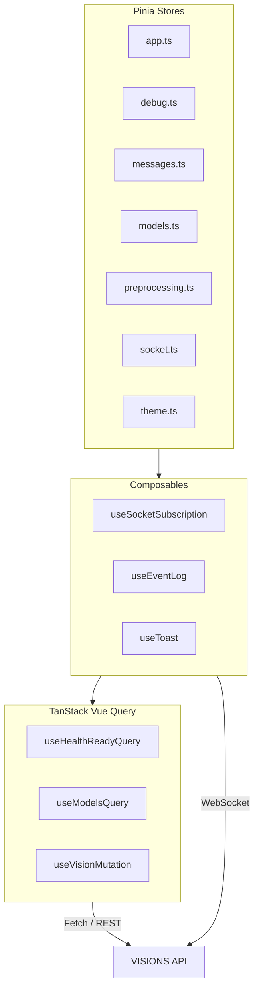
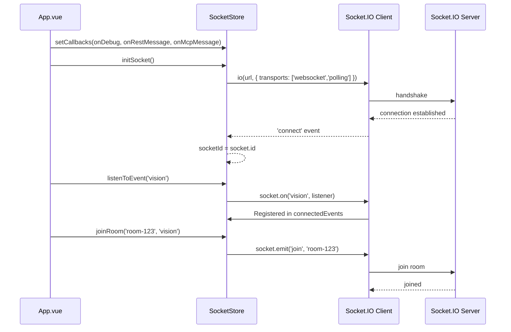
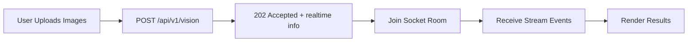

# 2.3 State Management & Real-time Events

## Store Architecture

The dashboard uses **Pinia** with the Composition API (`setup()` stores) to manage reactive, type-safe global state. Each store encapsulates a single domain concern and is accessed via composable functions that wrap store actions with domain-specific logic. The architecture separates **server state** (managed by TanStack Vue Query) from **client state** (managed by Pinia), preventing cache invalidation conflicts.



## Socket.IO Client State

### `socket.ts`

```typescript
interface SocketDebugEntry {
  endpoint: string;
  method: string;
  status: 'success' | 'error';
  statusCode?: number;
  errorMessage?: string;
  responseTime: number;
  type: 'http' | 'socket';
  direction: 'request' | 'response';
  requestId?: string;
  roomId?: string;
  event?: string;
  stream?: boolean;
  sessionId?: string;
}

interface SocketState {
  socket: any | null;              // socket.io-client instance
  connectionState: 'connected' | 'disconnected' | 'error';
  socketError: string | null;
  lastConnectionEvent: string;
  socketId: string | null;
  connectedEvents: Set<string>;
  connectedRooms: Map<string, Set<string>>;
}
```

| Action | Description |
|--------|-------------|
| `setCallbacks(onDebug, onRestMessage, onMcpMessage)` | Wire store-bound callback references for socket event routing (called once in `App.vue`) |
| `initSocket()` | Initialize `io` client with `['websocket', 'polling']` transports; returns existing socket if already connected |
| `ensureSocketConnection()` | Idempotent wrapper; connects if not already |
| `listenToEvent(eventName)` | Register `socket.on()` listener; defers to pending queue if not yet connected |
| `stopListening()` | Deregisters the first event listener from `connectedEvents` |
| `closeEvent(eventName)` | Remove listener + emit `leave` for all tracked rooms under that event |
| `closeRoom(eventName, roomId)` | Emit `leave` for a specific room and remove from tracking |
| `joinRoom(roomId, eventName)` | Emit `join` to the server and record room/event mapping |
| `leaveRoom(roomId, eventName)` | Emit `leave` to the server and purge room from tracking |
| `getConnectedEventsAndRooms()` | Returns sorted `event::room1::room2` strings for display |

### Connection Lifecycle



Important: `listenToEvent` **routes events to both REST and MCP message stores simultaneously**. Each store filters by its own `trackedRequestIds`, so the dual dispatch is harmless and avoids missing messages.

### Reconnection Strategy

```typescript
const socket = io(VITE_SOCKET_URL, {
  transports: ['websocket', 'polling'],
  reconnection: true,
  reconnectionAttempts: 5,
  reconnectionDelay: 1000,
  reconnectionDelayMax: 5000,
  randomizationFactor: 0.5,
});
```

Reconnection uses **exponential backoff with jitter** to prevent thundering-herd reconnections after a server restart. The fallback from WebSocket to polling ensures connectivity through restrictive network proxies.

## Event Log State

### `debugStore.ts`

The debug store maintains a tracked list of HTTP request/response entries and Socket.IO debug entries:

```typescript
interface DebugState {
  debugResults: DebugResult[];
  selectedDebugResult: DebugResult | null;
  lastSeenDebugCount: number;
  debugTabVisited: boolean;
}
```

| Action | Description |
|--------|-------------|
| `trackRequest(endpoint, method, promise, details?)` | Wraps an HTTP `Promise<Response>` to record timing, status, payload, and error on resolution or rejection |
| `addDebugResult(result)` | Appends an HTTP entry to `debugResults` (used internally by `trackRequest`) |
| `addSocketDebugEntry(result)` | Appends a Socket.IO debug entry to `debugResults` with endpoint, method, status, and timing |
| `clearDebugResults()` | Clears all results and resets selection/counters |
| `incrementDebugCount(newCount)` | Updates the unseen-result counter |
| `resetDebugCount()` | Resets the counter to the current list length |

REST and MCP response messages are stored in `messagesStore`, not `debugStore`. The `debugStore` focuses exclusively on HTTP traffic tracking and Socket debug metadata.

## Preprocessing State

### `preprocessingStore.ts`

Manages the reactive state for image preprocessing configuration.
The single source of truth is a `settings` ref persisted to `localStorage` via `useLocalStorageSync`. Convenience `computed` getters/setters expose `enabled`, `resize`, `variants`, and `parameters`.

```typescript
interface PreprocessingSettings {
  enabled: boolean;
  resize: PreprocessingResizeOptions;
  variants: PreprocessingVariantsOptions;
  parameters: PreprocessingParametersOptions;
}

interface PreprocessingResizeOptions {
  maxWidth: PreprocessingSize; // 256 | 384 | 512 | 640 | 768 | 1024
  maxHeight: number | null;
  withoutEnlargement: boolean;
}

interface PreprocessingVariantsOptions {
  original: boolean;
  grayscale: boolean;
  denoised: boolean;
  sharpened: boolean;
  clahe: boolean;
}

interface PreprocessingParametersOptions {
  blurSigma: number;
  sharpenSigma: number;
  sharpenM1: number;
  sharpenM2: number;
  brightnessLevel: number;
  claheWidth: number;
  claheHeight: number;
  claheMaxSlope: number;
  normalizeLower: number;
  normalizeUpper: number;
}
```

The store supports **bidirectional hover highlighting** between variants and parameters via `VARIANT_PARAMETERS` and `PARAMETER_VARIANTS` maps. When a user hovers over a variant tile, the related parameter inputs are visually highlighted, and vice versa.

## Message Store

### `messages.ts`

Persisted via two factory-generated instances: `useRestMessagesStore` and `useMcpMessagesStore`.

```typescript
interface MessageState {
  messages: Message[];
  trackedRequestIds: Set<string>;
}
```

The store filters incoming socket events by `trackedRequestIds` to prevent orphaned messages from appearing when the user navigates between tabs:

| Action | Description |
|--------|-------------|
| `trackRequest(requestId)` | Add a request ID to the tracked set |
| `addMessage(event, data)` | Append or update an existing message by `requestId`; concatenate streaming chunks |
| `addPendingMessage(event, roomId, requestId, task, stream)` | Inject a placeholder entry before socket response |
| `updatePendingMessage(requestId, data)` | Replace the placeholder with actual data |
| `removeMessage(requestId)` | Delete a message and its tracked ID |
| `clearMessages()` | Wipe all messages and tracked IDs |
| `completedCount` | Computed count of non-pending messages |

Messages are not persisted to `localStorage` to prevent unbounded growth. The `trackedRequestIds` pattern enables O(1) filtering of irrelevant socket events when switching between REST and MCP tabs.

## Models Store

### `modelsStore.ts`

Caches the list of available Ollama models:

```typescript
interface ModelsState {
  models: string[];
  modelsLoading: boolean;
}
```

Loaded via `fetchModels()` called in `App.vue` on mount. The selected model per-tab is stored in `localStorage` via `useLocalStorage` in the respective panel (`RestPanel.vue` / `McpPanel.vue`), not in the models store.

## App Store

### `app.ts`

Manages global UI state and cross-cutting actions:

```typescript
interface AppState {
  activeTab: 'rest' | 'mcp' | 'debug' | 'preprocessing';
  abortingId: string | null;
  copiedIndex: number | null;
  blinkLogo: boolean;
}
```

| Action | Description |
|--------|-------------|
| `refreshRestRequestId()` | Generate a new UUID for the REST panel |
| `refreshMcpRequestId()` | Generate a new UUID for the MCP panel |
| `handleModelSelected()` | Trigger logo blink animation (3s) |
| `handleCopyToClipboard(text, index)` | Copy result text to clipboard; show ephemeral feedback |
| `abortJob(requestId)` | POST `/api/v1/vision/cancel` with the given `requestId`; return success flag |

## Real-time Event Flow



### Event Consumption

```typescript
// use-socket-subscription.ts (conceptual)
const events = ref<VisionEvent[]>([]);

onMounted(() => {
  socketStore.socket?.on('vision', (payload) => {
    events.value.push(payload);
    if (payload.done) eventLog.add({ type: 'response', category: 'vision', data: payload });
  });
});

onUnmounted(() => {
  socketStore.socket?.off('vision');
});
```

### State Transition Diagram

```
IDLE → UPLOADING → PROCESSING → RECEIVING → COMPLETE
  ↓       ↓            ↓           ↓
ERROR ←──┴────────────┴───────────┘
```

| Transition | Trigger | Store Action |
|------------|---------|--------------|
| `IDLE → UPLOADING` | User selects files | File upload validation |
| `UPLOADING → PROCESSING` | `202` response received | Join socket room, start polling |
| `PROCESSING → RECEIVING` | First `vision` event received | Append to event log |
| `RECEIVING → COMPLETE` | `done: true` received | Finalize message, show toast |
| `Any → ERROR` | Socket `connect_error` or HTTP 4xx/5xx | Show error toast, log failure |

## Performance and Memory

| Concern | Strategy |
|---------|----------|
| **Event log growth** | Plain array (`unshift`); grows unbounded until cleared manually |
| **Socket reconnection** | Exponential backoff with max delay; duplicate event deduplication via `loggedRequestIds` Set |
| **Image previews** | `URL.createObjectURL` with `revokeObjectURL` cleanup on unmount |
| **Store subscription leaks** | `onScopeDispose` in composables; `off()` event listeners on unmount |
| **Message persistence** | In-memory only; no `localStorage` to prevent quota exhaustion |

## Related Documentation

- [2.1 Frontend Architecture](2.1-architecture.md) — Component hierarchy and composables
- [2.2 Color Harmony & Theming](2.2-color-harmony.md) — ThemeStore and visual state
- [1.4 Socket.IO Real-time Layer](1.4-socketio.md) — Server-side emission patterns
