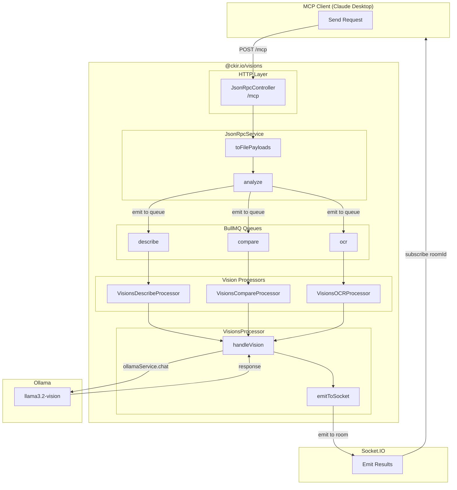
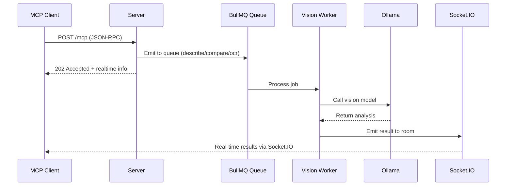

# MCP Architecture

This document describes the architectural flow of the MCP (Model Context Protocol) implementation.

## Overview

The MCP endpoint provides a JSON-RPC 2.0 interface for image analysis using the Socket.IO protocol for real-time results.



## Request Flow

### 1. Client sends MCP request

```
POST /mcp?requestId=1234&roomId=room-123&stream=true
Content-Type: multipart/form-data
x-vision-llm: llama3.2-vision

--boundary
Content-Disposition: form-data; name="payload"
{
  "jsonrpc": "2.0",
  "method": "tools/call",
  "params": {
    "name": "visions.analyze",
    "arguments": {
      "task": "describe",
      "prompt": [{"role": "user", "content": "Describe this image"}]
    }
  },
  "id": 2
}
--boundary
Content-Disposition: form-data; name="images"; filename="photo.jpg"
<image data>
--boundary--
```

### 2. Controller processes request

```typescript
async rpc(
  @Query(REQUEST_ID) requestId: string,
  @Headers(X_VISION_LLM) vLLM: string,
  @MultiPartPayload() req: McpGenericType,
  @MultiPartImages() images?: Array<MultipartFile>,
) {
  // Method: initialize → return server info
  // Method: tools/list → return available tools
  // Method: tools/call → analyze images
}
```

### 3. Service handles processing

```typescript
async analyze(req) {
  // 1. Emit to BullMQ queue for async processing
  void this.analyzeImageService.emit({ buffers, meta, filters });
  
  // 2. Return immediate response with realtime info
  return { content, isError, realtime };
}
```

## Response Flow

### MCP Response (HTTP 202)



```json
{
  "jsonrpc": "2.0",
  "id": 2,
  "result": {
    "content": [
      {
        "type": "text",
        "text": "Processing started. Connect to Socket.IO for real-time results."
      }
    ],
    "isError": false,
    "realtime": {
      "event": "vision",
      "roomId": "room-123",
      "requestId": "1234"
    }
  }
}
```

### Socket.IO Real-time Results

```json
{
  "meta": [
    {
      "name": "photo.jpg",
      "type": "image/jpeg",
      "hash": "abc123...",
      "requestId": "1234"
    }
  ],
  "task": "describe",
  "message": {
    "role": "assistant",
    "content": "The image shows a cat sitting on a windowsill..."
  },
  "done": false
}
```

## Key Components

| Component | Description |
|------------|-------------|
| `JsonRpcController` | Handles HTTP requests, routes MCP methods |
| `JsonRpcService` | Business logic, image processing, queue emission |
| `AnalyzeImageService` | Dispatches jobs to BullMQ queues |
| `VisionsDescribeProcessor` | BullMQ processor for describe task |
| `VisionsCompareProcessor` | BullMQ processor for compare task |
| `VisionsOCRProcessor` | BullMQ processor for OCR task |
| `VisionsProcessor` | Base class with `handleVision` and `emitToSocket` |
| `OllamaService` | Wrapper around Ollama API |
| `Socket.IO` | Real-time result streaming |

## Data Structures

### Realtime Info

The `realtime` object is returned in the MCP response and used for correlation:

| Field | Type | Description |
|-------|------|-------------|
| `event` | string | Socket.IO event name (default: `vision`) |
| `roomId` | string? | Room ID for subscribing to results |
| `requestId` | string | Client-provided request correlation ID |

### Filters

Passed through to workers for processing:

| Field | Type | Description |
|-------|------|-------------|
| `requestId` | string | Request correlation ID |
| `roomId` | string? | Socket.IO room |
| `stream` | boolean | Enable streaming |
| `numCtx` | number? | Model context size |
| `vLLM` | string | Ollama model name |
| `task` | string | Task type: `describe`, `compare`, `ocr` |
| `prompt` | array? | Prompt messages |
