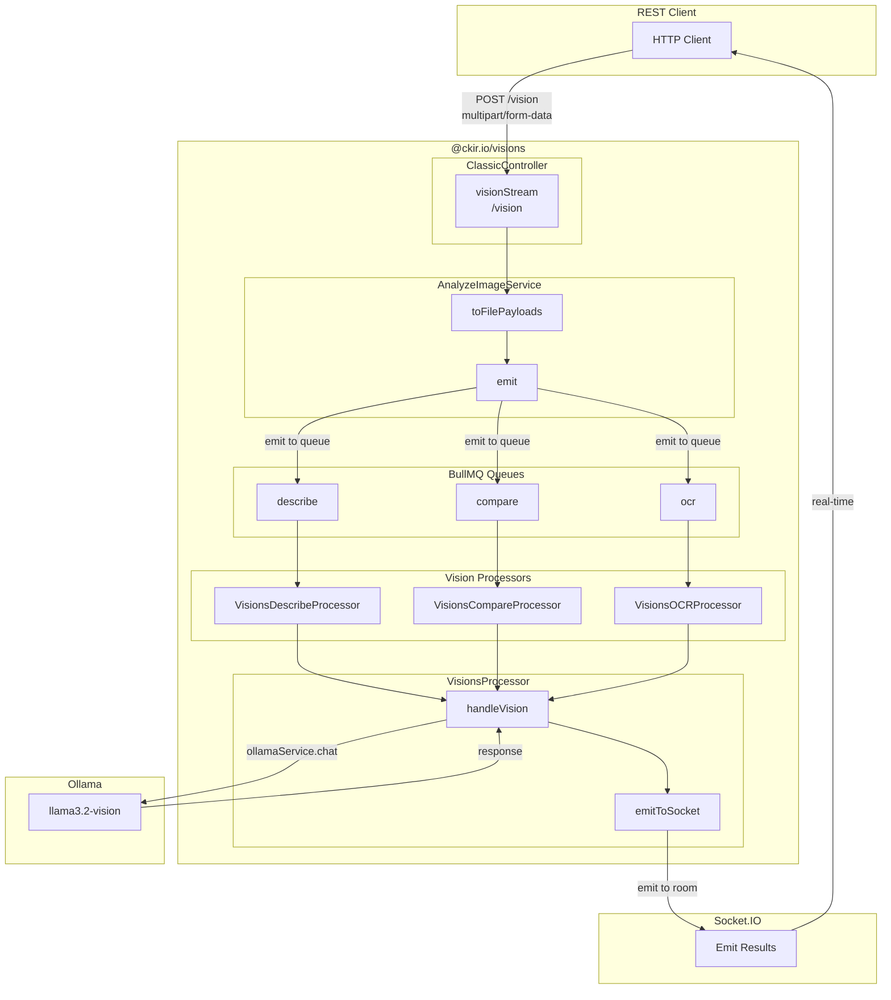
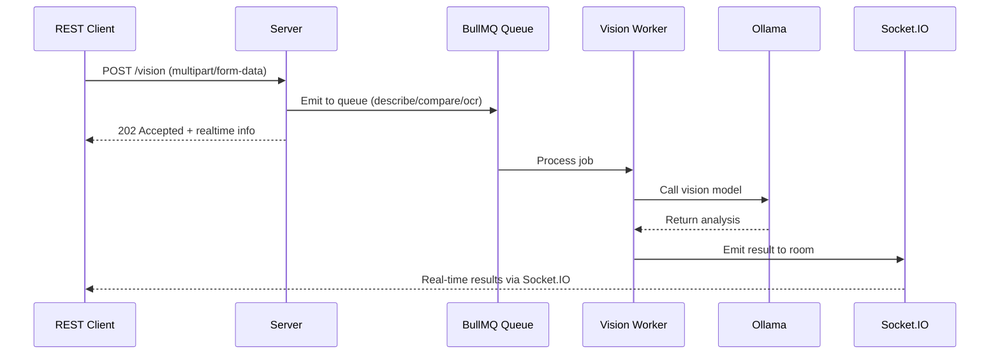

# REST API Architecture

This document describes the architectural flow of the REST API implementation.

## Overview

The REST API provides a multipart/form-data endpoint for image analysis, using Socket.IO for real-time results.



## Request Flow

### 1. Client sends REST request

```
POST /vision?requestId=1234&roomId=room-123&stream=true
Content-Type: multipart/form-data
x-vision-llm: llama3.2-vision

--boundary
Content-Disposition: form-data; name="task"
describe
--boundary
Content-Disposition: form-data; name="prompt"
[{"role": "user", "content": "Describe this image"}]
--boundary
Content-Disposition: form-data; name="images"; filename="photo.jpg"
<image data>
--boundary--
```

### 2. Controller processes request

```typescript
async visionStream(
  @Query(REQUEST_ID) requestId: string,
  @Headers(X_VISION_LLM) vLLM: string,
  @MultiPartValue(TASK) task: MultipartValue<VisionTask>,
  @MultiPartFiles() images?: Array<MultipartFile>,
): Promise<ClassicControllerResponse> {
  // 1. Convert images to buffers
  const results = await this.analyzeImageService.toFilePayloads(requestId, images);

  // 2. Emit to BullMQ queue
  void this.analyzeImageService.emit({ buffers, meta, filters });

  // 3. Return realtime info
  return { realtime: { event, roomId, requestId } };
}
```

## Response Flow

### REST Response (HTTP 202)



```json
{
  "realtime": {
    "event": "vision",
    "roomId": "room-123",
    "requestId": "1234"
  }
}
```

### Socket.IO Real-time Results

```json
{
  "meta": [
    {
      "name": "photo.jpg",
      "type": "image/jpeg",
      "hash": "abc123...",
      "requestId": "1234"
    }
  ],
  "task": "describe",
  "message": {
    "role": "assistant",
    "content": "The image shows a cat sitting on a windowsill..."
  },
  "done": false
}
```

## Key Components

| Component | Description |
|------------|-------------|
| `ClassicController` | Handles HTTP requests, processes multipart uploads |
| `AnalyzeImageService` | Image processing, queue dispatch |
| `VisionsDescribeProcessor` | BullMQ processor for describe task |
| `VisionsCompareProcessor` | BullMQ processor for compare task |
| `VisionsOCRProcessor` | BullMQ processor for OCR task |
| `VisionsProcessor` | Base class with `handleVision` and `emitToSocket` |
| `OllamaService` | Wrapper around Ollama API |
| `Socket.IO` | Real-time result streaming |

## Data Structures

### Realtime Info

The `realtime` object is returned in the REST response:

| Field | Type | Description |
|-------|------|-------------|
| `event` | string | Socket.IO event name (default: `vision`) |
| `roomId` | string? | Room ID for subscribing to results |
| `requestId` | string | Client-provided request correlation ID |

### Filters

Passed through to workers for processing:

| Field | Type | Description |
|-------|------|-------------|
| `requestId` | string | Request correlation ID |
| `roomId` | string? | Socket.IO room |
| `stream` | boolean | Enable streaming |
| `numCtx` | number? | Model context size |
| `vLLM` | string | Ollama model name |
| `task` | string | Task type: `describe`, `compare`, `ocr` |
| `prompt` | array? | Prompt messages |

## Comparison: REST vs MCP

| Feature | REST API | MCP |
|---------|----------|-----|
| Endpoint | `/vision` | `/mcp` |
| Content-Type | multipart/form-data | multipart/form-data |
| Request Format | Form fields | JSON-RPC payload |
| Task via | `task` field | `arguments.task` |
| Prompt via | `prompt` field | `arguments.prompt` |
| Response | `{ realtime: {...} }` | `{ result: { realtime: {...} } }` |
