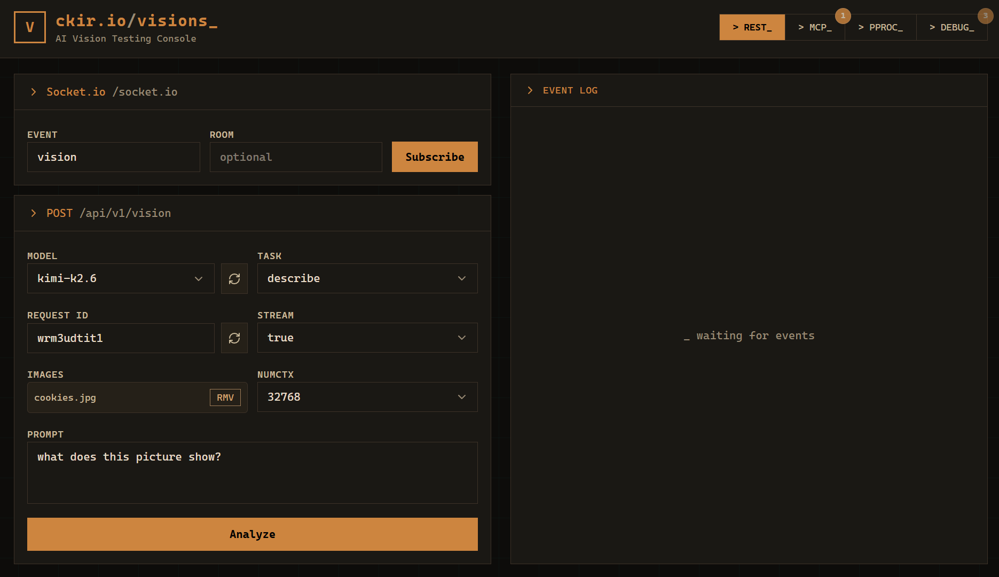

# @CKIR.IO/VISIONS

A NestJS microservice monorepo for AI-powered image analysis using locally-hosted Ollama vision models. Supports image description, comparison, and OCR via REST, MCP (Model Context Protocol) JSON-RPC 2.0, and streaming real-time results over Socket.IO.

 

 

 

## What is VISIONS?

**@CKIR.IO/VISIONS** is a horizontally-scalable NestJS microservice that offloads vision analysis to BullMQ workers backed by Redis/KeyDB. It exposes two ingress protocols—REST and MCP—over a single Fastify HTTP server, with real-time results streamed over Socket.IO. A Vue 3 dashboard provides a debug console and user-facing UI.

### Built with AI-Assisted Context Coding, Owned by Humans

This project was developed using **context coding**—a disciplined  [AI-assisted](.wiki/3-ai-assisted-development.md) paradigm where generative tools accelerate boilerplate and exploration while every architectural decision, interface contract, and failure mode is deliberately reviewed, tested, and owned. We believe velocity without ownership accelerates directly into technical insolvency.

 

## Contributing & License

Contributions are welcome! Please open an issue first to discuss what you would like to change or add. This project follows [Semantic Versioning](https://semver.org/). Pull requests must pass CI before they can be merged. Distributed under the MIT License. 
See [LICENSE](LICENSE) for more information.

 

[E-MAIL](mailto:eugen.hildt@gmail.com) · [WIKI](https://github.com/ehildt/ckir.io-visions/wiki) · [ISSUES](https://github.com/ehildt/ckir.io-visions/issues) · [DONATE](https://github.com/sponsors/ehildt)

